# CODEASTRA 2.0 — MASTER RESEARCH RECORD

**Hackathon:** CODEASTRA 2.0 · MCT's Rajiv Gandhi Institute of Technology (RGIT), Mumbai
**Prepared:** 8 October 2026
**Inputs:** `RGIT prb statements.pdf` (12 problem statements, 4 domains) · `RGIT ppt format.pdf` (6-slide idea-PPT template + 7 rules)
**Decision:** **WEB-2 — Health Outbreak Detection & Alert System** → product **VARSHA** (*Vector-And-Rain-driven Surveillance for Health Alerts*). *Varsha* means "rain / monsoon" in Hindi, Marathi and Sanskrit.

> **Evidence tags used throughout**
> - **[FACT]**: verified from a cited source, or from a live API call made on 8 Oct 2026 (logged in Appendix A)
> - **[INFERENCE]**: our reasoning from facts
> - **[PROPOSAL]**: our design decision or target, not yet validated
> - **[UNVERIFIED]**: widely cited but not re-checked in this research session
>
> All URLs are collected in Section 22. Numbers quoted from press reports of official data are marked as such.

---

## 0. TL;DR — read this first

- **Winner: WEB-2 Health Outbreak Detection & Alert System, weighted score 8.35/10.** Runner-up CYBER-1 Phishing (7.75). Third CLOUD-1 AI Auto-Scaling (7.05). Full matrix in Section 9; sensitivity check included.
- **Why it wins:**
  1. **Real official data.** India's IDSP outbreak line-list goes back to 2009 (29,433 rows mirrored by Dataful, updated 8 Oct 2026).
  2. **Live data.** Weather (Open-Meteo, NOAA station history, IMD API) and news (GDELT) are live and free.
  3. **Life-or-death impact in Mumbai itself.** Leptospirosis in Mumbai jumped from 33 cases in June 2026 to 78 in July 2026 after the 1–7 July deluge.
  4. **A genuine, evidenced gap.** Existing systems either scan news after cases appear (Wadhwani AI Health Sentinel) or forecast dengue in other cities (ARTPARK, IITM).
- **The insight:**
  - Leptospirosis exposure happens on known days: flood days.
  - BMC's own advice is to seek preventive treatment **within 24–72 hours** of exposure.
  - Cases surge **7–12 days** later (Supe et al., NMJI 2018).
  - Official IDSP bulletins appear **~5–7 weeks** after the week they describe [INFERENCE, Appendix B].
  - In July 2026, heavy rain began 1–2 July and waterlogging peaked 4 July. BMC's citywide advisory went out the night of 6 July.
  - **The warning arrives after much of the prevention window has closed.**
- **What VARSHA does:**
  1. Fuses live rainfall with flood hotspots and ward vulnerability into a **ward-level exposure index**.
  2. Forecasts the leptospirosis surge window (7–14 days ahead) and dengue/malaria risk (weeks ahead).
  3. Detects unusual patterns in official and news data.
  4. **Optimizes where BMC should act**: fever camps, clinic hours, vector-control squads.
  5. Pushes **same-day, ward-targeted alerts** in Marathi, Hindi and English.
- **Wow moment:** a "Time Machine" replay of the real July 2026 flood. The map floods, VARSHA's alert fires, the BMC advisory marker appears days later, and then the real case jump lands.
- **Biggest risk:** ward-level case data is not public, so validation is city-level.
  - **Mitigation:** predict ward **exposure** and city **cases**, publish an honest backtest (including a likely false alarm in Aug 2025), and design the pipeline to absorb BMC's internal data later.
- **Next steps:** see the pre-hackathon checklist in §12.10.

---

## 1. All Problem Statements

### 1.1 The 12 official problem statements (verbatim from the PDF)

The PDF numbers problems 1–3 within each domain. This record uses `DOMAIN-n` IDs and a running `P#`.

| P# | ID | Domain (official label) | Official title | Exact official statement |
|---|---|---|---|---|
| P1 | AIML-1 | Domain : AIML | Crop Disease Detector from Leaf Images | "Upload a photo of a plant leaf and get a probable disease diagnosis with remedies." |
| P2 | AIML-2 | Domain : AIML | Personal Finance Advisor Chatbot | "A conversational assistant that analyzes spending patterns from uploaded bank statements/CSV and gives saving tips." |
| P3 | AIML-3 | Domain : AIML | Traffic Congestion Predictor | "Predicts congestion on common city routes using historical + live data for better commute planning." |
| P4 | CLOUD-1 | Domain : Cloud computing & Distributed System | Intelligent Auto-Scaling for AI Workloads | "Cloud AI workloads can fluctuate dramatically. Running excessive GPU infrastructure wastes resources, while insufficient resources cause unacceptable latency." |
| P5 | CLOUD-2 | Domain : Cloud computing & Distributed System | Distributed Data Synchronization System | "Design a system that keeps data synchronized across geographically distributed services while handling network delays, conflicting updates and temporary disconnections." |
| P6 | CLOUD-3 | Domain : Cloud computing & Distributed System | Autonomous Cloud Operations Platform | "Design an intelligent cloud operations platform that continuously observes infrastructure, detects anomalies, predicts failures and recommends or executes corrective actions." |
| P7 | WEB-1 | Domain : Web & Product Development | Blood Donor-Recipient Matching Web Platform | "A web portal connecting blood donors with recipients/hospitals in real time based on blood group and location." |
| P8 | WEB-2 | Domain : Web & Product Development | Health Outbreak Detection & Alert System | "Analyse real-time health and public-health data to detect unusual disease patterns early and issue timely alerts about potential outbreaks." |
| P9 | WEB-3 | Domain : Web & Product Development | Event Co-Planning Website for Friend Groups | "A website where a group can propose event ideas, vote, split costs, and finalize plans without endless group-chat back-and-forth." |
| P10 | CYBER-1 | Domain : Cybersecurity & Blockchain | Phishing Email/URL Detector | "A tool/browser extension that analyzes emails or links and flags likely phishing attempts with reasoning." |
| P11 | CYBER-2 | Domain : Cybersecurity & Blockchain | QR Code Safety Scanner | "Scans QR codes before opening them and warns users if the destination looks malicious." |
| P12 | CYBER-3 | Domain : Cybersecurity & Blockchain | Secure Voting System for College Elections | "A tamper-evident digital voting prototype for student council elections with audit logging." |

### 1.2 Interpretation table

| P# | What organizers actually ask for | Obvious / common interpretation | Potential hidden opportunity | Initial difficulty |
|---|---|---|---|---|
| P1 | Image → probable disease + remedy | CNN on PlantVillage + remedy lookup | Calibrated "I don't know" (open-set) + region-level epidemic signals (Kisan Call Centre queries + weather) | Low |
| P2 | Statement/CSV → spending analysis → saving tips, conversationally | CSV upload + pie charts + LLM tips | "Personal inflation rate" (map spends to CPI-2024 items), debt-stack early warning, regulation-aware advice | Low–Med |
| P3 | Route congestion prediction from historical + live data | LSTM on a Kaggle traffic dataset + map | Monsoon/waterlogging-aware commute risk with uncertainty-aware leave-time decisions | Med |
| P4 | Scale GPU capacity to fluctuating AI load: cut waste and latency | HPA on CPU/GPU utilization, maybe a Prophet forecast | Token-aware, cold-start-aware predictive scaling validated on real Azure LLM traces, with ₹/SLO trade-off | Med–High |
| P5 | Geo-distributed sync with delays, conflicts and disconnections | Last-write-wins sync / Firebase clone | Offline-first sync for frontline health workers with semantic conflict resolution | High |
| P6 | Observe → detect anomalies → predict failures → recommend/execute fixes | Prometheus + Grafana + threshold alerts + LLM summary | Safe, verifiable auto-remediation (dry-run before acting, blast-radius policy) | High |
| P7 | Real-time donor ↔ recipient matching by group and location | Donor registry + search + notifications | Platelet/blood demand forecasting (dengue-driven), expiry-aware redistribution | Low |
| P8 | Real-time health data → detect unusual patterns early → timely alerts | Case dashboard + threshold alerts, or news scraper + map | **Predict outbreaks from environmental exposure before cases appear; act inside the prevention window** | Med–High |
| P9 | Group proposes → votes → splits costs → finalizes | Polls + Splitwise clone | Fair consensus engine (social choice + constraints) | Low |
| P10 | Analyze emails/links → flag phishing with reasoning | URL-feature classifier + Chrome extension + LLM explanation | Pre-emptive Indian brand-impersonation radar (CT logs, new domains) + campaign graph + citizen last mile | Med |
| P11 | Scan QR → warn if destination malicious | Decode QR → check URL reputation | UPI-intent decoding ("you are PAYING ₹X, not receiving") + sticker-swap detection | Low–Med |
| P12 | Tamper-evident voting prototype with audit logging | Blockchain dApp voting | End-to-end verifiable voting (Helios/Belenios-style), not blockchain | Med–High |

### 1.3 Official PPT rules (verbatim from `RGIT ppt format.pdf`, slide 7)

1. Keep the maximum slides limit up to six (6), including the title slide.
2. Avoid lengthy paragraphs and use concise points, diagrams, workflows, infographics or relevant visuals.
3. Keep the explanation precise, clear and easy to understand.
4. Clearly highlight the problem, proposed solution, key features and innovation/USP.
5. Mention the technology stack, target users, impact and future scope wherever applicable.
6. Ensure the idea is original, feasible and practically implementable.
7. Follow the prescribed PPT template and formatting guidelines.

🔴 Note: remove the "Important Pointers" slide before submitting.

**Template slide titles:**

| # | Slide title | Notes |
|---|---|---|
| 1 | Team Details | Team ID, Team Name, Leader Name, Domain Chosen, Problem Statement |
| 2 | Problem Analysis | |
| 3 | Proposed Solution & Key Features | |
| 4 | Technical approach & Innovation | |
| 5 | Impact & Future Scope | |
| 6 | Supporting Information (workflow, architecture, wireframes, research, references) | Optional |

The template uses a dark space-themed background with MCT/ABIT/Synergy logos in the header.

### 1.4 Hackathon context

- **[FACT]** CODEASTRA 1.0 (Devfolio, part of Synergy 2.0):
  - 24-hour hackathon, 18–19 March 2025, at RGIT, Juhu Versova Link Road, Andheri West.
  - Teams of 3–4.
  - Prizes worth ₹1,00,000 (₹50K cash + ₹50K vouchers) plus an internship for winners.
  - Team selection was based on a combined team CV.
  - Instagram: abit.rgit.
- **[INFERENCE]** CODEASTRA 2.0 likely follows a similar 24-hour build format. This edition adds an **idea-PPT shortlisting round**. The PPT must win shortlisting, and the build must win the finals. Plan for both.

---

## 2. Initial Evaluation

| P# | Initial hypothesis (before research) | After research | Status |
|---|---|---|---|
| P1 Crop | Common; strong datasets | Government NPSS (Aug 2024) and Plantix (~10M users) dominate; lab-to-field accuracy gap is real | Eliminated: low novelty |
| P2 Finance | Common; privacy problem | No public real transaction data; SEBI registration needed for securities advice; crowded market | Eliminated: weak data + regulatory trap |
| P3 Traffic | Common; Google Maps problem | Live data only via limited free tiers; Mumbai history must be self-collected; Google/Mappls own the use case | Eliminated: can't beat incumbents on their core |
| P4 AI autoscaling | Strong real traces | Excellent real data (Azure, BurstGPT); but SageServe (Microsoft/IISc 2025), AIBrix, llm-d and NVIDIA Dynamo already do predictive/LLM-aware scaling | **Top 5 (#3)** |
| P5 Sync | No real data | Mature sync engines (ElectricSQL 1.0, PowerSync, Ditto, CRDT libraries); no domain data | Eliminated: no data story |
| P6 AIOps | Strong demo | Real benchmarks plus live fault injection; but very crowded (Resolve AI at $1B valuation, Traversal, Cleric, HolmesGPT) | **Top 5 (#4)** |
| P7 Blood | Cliché | Emotional, but no public stock API; donor data private; dozens of clones | Eliminated (strong cross-link idea: platelets ↔ dengue forecast) |
| P8 Health outbreak | Promising if Indian data is usable | Official IDSP line-list 2009–2026; live weather and news; Mumbai monsoon mortality; evidenced gap in prevention-window early warning | **WINNER** |
| P9 Event planning | Low impact | Partiful, Apple Invites, WhatsApp Events, Splitwise cover it; no real data | Eliminated |
| P10 Phishing | Common but data-rich | Best real/live data of all 12; huge Indian fraud losses; but most common hackathon idea; CloudSEK/Bolster/research cover pre-emptive detection for enterprises | **Top 5 (#2)** |
| P11 QR | Common | Real UPI/QR fraud stats; QR-specific data thin; UPI-intent angle is fresh but narrow | **Top 5 (#5)** |
| P12 Voting | Blockchain trap | Helios/Belenios/ElectionGuard exist; experts warn against blockchain/internet voting; no data | Eliminated |

---

## 3. Detailed Research (A–O for every problem)

Key: **A** importance · **B** users · **C** impact · **D** existing solutions · **E** gaps · **F** public data · **G** real-time data · **H** APIs · **I** feasibility · **J** innovation · **K** demo potential · **L** scalability · **M** risks · **N** USP potential · **O** judging appeal. Each problem ends with its "everyone builds this" ladder (Phase 4).

### 3.1 P1 — AIML-1 Crop Disease Detector

- **A.** [FACT] FAO/IPPC have repeatedly stated that up to 40% of global crop production is lost to pests each year, and that plant diseases cost the global economy over US$220B a year. The methodology is not published, and an older FAO quote put losses at 10–16% of the harvest.
- **B.** Smallholder farmers, Krishi Vigyan Kendras / extension workers, agri-input retailers, state agriculture departments.
- **C.** Huge problem, but the **marginal** impact of another diagnosis app is low because incumbents exist (D).
- **D.**
  - [FACT] **Plantix** (PEAT GmbH): ~10M people accessed it and ~6.3M were active in Feb 2022–2023; ~80% are in India; it flags 500+ threats across 50 crops using a 60M-image database (FAO AgriTech Observatory).
  - [FACT] **National Pest Surveillance System (NPSS)**, Government of India: launched 15 Aug 2024 by the Agriculture Minister. Photo-based AI pest identification, 61–73 crops reported, 6 languages, connects farmers to experts. Run by DPPQS + ICAR-NCIPM.
  - Others: PlantVillage Nuru, Google Lens, Kisan Call Centre (1800-180-1551) [UNVERIFIED number].
- **E.**
  - [FACT] Lab-to-field generalization: Mohanty, Hughes & Salathé (2016) reached 99.35% on held-out PlantVillage but **31.4%** on images from other sources. A 2022 paper flags PlantVillage dataset bias.
  - Missing: calibrated abstention, links to regional risk, Indian field datasets.
- **F.**
  - [FACT] PlantVillage (~54,300 lab images, 38 classes).
  - [UNVERIFIED in this session] PlantDoc (field images), Paddy Doctor (Indian paddy), Cassava (Kaggle).
  - [FACT] Kisan Call Centre (KCC) query transcripts on data.gov.in / AIKosh, district × month. A 2024 study analyzed >4M Rajasthan calls (2009–2023) via the KCC-CHAKSHU portal.
- **G.** No public live disease prevalence feed (NPSS data is internal). Weather only.
- **H.** Open-Meteo, IMD API (weather). No public crop-disease API found.
- **I.** Very high (pretrained vision models + datasets).
- **J.** Open-set rejection; weather-driven disease risk; KCC queries as crowdsourced plant-disease surveillance.
- **K.** Upload leaf → diagnosis. Judges have seen it many times.
- **L.** National in principle, but competing with government NPSS.
- **M.** Misdiagnosis → pesticide misuse; dataset bias; incumbents.
- **N.** "The crop doctor that knows when it doesn't know."
- **O.** Low–moderate (fatigue).
- **Ladder:**
  - Basic: CNN on PlantVillage + remedy table.
  - Better: multilingual mobile app.
  - Strong: field-robust model (PlantDoc fine-tune) + OOD rejection.
  - Competition-level: + weather-driven risk + KCC signal map.
  - Exceptional: block-level crop-epidemic early warning. **Collides with NPSS.**

### 3.2 P2 — AIML-2 Personal Finance Advisor Chatbot

- **A.** [FACT, press reports of RBI FSRs]
  - Household debt ~45.5% of GDP (Sept 2025).
  - Non-housing retail loans ~58% of household borrowing (Mar 2026).
  - Fintech lenders hold 56.8% of loans under ₹50,000.
  - Borrowers with loans from 5+ lenders show elevated impairment.
  - Household net financial assets ~6% of GDP in FY25 (5.3% in FY24; FY23 low of 4.9%).
- **B.** Young earners, gig workers, students, first-time borrowers.
- **C.** Moderate. Mostly personal benefit.
- **D.**
  - ET Money, INDmoney, Fi, Jupiter, CRED, bank PFM tools, Cleo (UK/US).
  - [FACT] India's Account Aggregator ecosystem: 340M+ consents by Dec 2025 (Sahamati); 16–17 AAs; 650+ FIUs.
- **E.**
  - [FACT] SEBI requires Investment Adviser registration for advice on securities.
  - [FACT] Since 8 Jan 2025, registered RAs/IAs must disclose AI usage. A June 2025 SEBI consultation proposes AI/ML governance.
  - "Advice" is therefore a regulatory trap.
- **F.**
  - [FACT] No public dataset of real Indian bank statements.
  - [FACT] AA sandboxes (Setu, Onemoney) provide test data.
  - [FACT] Real macro data: CPI 2024-base (released 12 Feb 2026; 358 items; COICOP 2018; item-level indices) via MoSPI eSankhyiki (API module; beta MCP server).
- **G.** Only the user's own statements (real but private). Live AA data needs an RBI-regulated FIU.
- **H.** Setu/Onemoney AA sandbox; eSankhyiki API.
- **I.** High.
- **J.** Personal inflation rate; debt-stack / multi-lender early warning; UPI micro-leak detection; regulation-aware guardrails.
- **K.** Moderate.
- **L.** Large market, crowded.
- **M.** Privacy (DPDP Act), SEBI, hallucinated advice.
- **N.** "Your personal CPI."
- **O.** Moderate.
- **Ladder:**
  - Basic: CSV + charts + LLM tips.
  - Better: categorization + budgets.
  - Strong: subscription/leak detection.
  - Competition-level: AA-consented data + personal CPI + debt-trap warning.
  - Exceptional: still data-poor and regulated.

### 3.3 P3 — AIML-3 Traffic Congestion Predictor

- **A.** [FACT] TomTom Traffic Index 2025 (Jan 2026), average time per 10 km:

  | City | Time per 10 km | Global congestion rank |
  |---|---|---|
  | Bengaluru | 36 min 9 s | 2nd (74.4%) |
  | Kolkata | 35 min 18 s | 29th |
  | Pune | 33 min 20 s | 5th |
  | Mumbai | 28 min 51 s | 18th |

- **B.** Commuters, fleets, traffic police, logistics.
- **C.** Time and fuel savings. Google Maps already offers live and typical-traffic ETAs, so marginal impact is moderate.
- **D.** Google Maps, Waze, Mappls (MapmyIndia), Apple Maps, TomTom. For Mumbai floods: iFLOWS-Mumbai (official, launched 2020), BMC disaster-management app.
- **E.** Uncertainty-aware "leave by" decisions; monsoon-aware routing; multimodal (local trains).
- **F.**
  - [FACT] TomTom Traffic Flow: 2,500 free non-tile requests/day (daily model). A monthly free tier per API was announced from 1 July 2026; check the live page.
  - [FACT] Uber Movement: no shutdown notice found, but its status is unclear.
  - [UNVERIFIED] US benchmarks: PeMS, METR-LA, PEMS-BAY.
  - [FACT] Mumbai Traffic Police flagged 215 flood-prone spots (media).
  - No public Mumbai historical traffic. You must self-collect by polling.
- **G.** Yes, but quota-limited.
- **H.** TomTom, HERE, Google Routes (paid with free caps) [UNVERIFIED current caps], OSM.
- **I.** Moderate: historical data has to be collected days in advance.
- **J.** Monsoon commute risk; probabilistic ETA; event-aware.
- **K.** Map with congestion (familiar).
- **L.** City by city.
- **M.** API quotas; cannot out-predict Google on its own turf.
- **N.** "Should I leave now or in 20 minutes?" with confidence.
- **O.** Moderate (common).
- **Ladder:**
  - Basic: LSTM on Kaggle data.
  - Better: live API + map.
  - Strong: spatio-temporal GNN on PeMS.
  - Competition-level: Mumbai polling + weather + events + leave-time optimizer.
  - Exceptional: monsoon multimodal commute risk. Overlaps iFLOWS / Google.

### 3.4 P4 — CLOUD-1 Intelligent Auto-Scaling for AI Workloads

- **A. Importance.**
  - [FACT] Cast AI's 2026 State of Kubernetes Optimization report puts average GPU utilization at ~5% (AKS ~2%, EKS ~5%, GKE ~6%). This is vendor data, measured before optimization.
  - [FACT] LLM cold starts:
    - 70B FP16 takes ~2–5 minutes to load (Meta's Llama autoscaling guide).
    - Sub-10B models take ~50 s; ~70B take ~160 s (InstantInfer).
    - AIBrix reports 2–3 minute pod start delays.
  - **Reactive scaling arrives after the burst.**
- **B. Users.**
  - ML platform teams, AI startups, cloud providers.
  - [FACT] IndiaAI compute portal: ~34,000 GPUs; ~9.3M GPU-hours sanctioned for 237 projects by Aug 2026; bids ₹115.85–150 per GPU-hour before subsidy.
- **C. Impact.** Cost and energy. B2B, measurable in ₹ and SLO violations.
- **D. Existing solutions.**
  - [FACT] Kubernetes HPA; KEDA; Knative KPA.
  - **AIBrix** (ByteDance; APA/KPA/optimizer-based autoscaler).
  - **llm-d** (EPP and WVA paths; WVA is Developer Preview in OpenShift AI 3.5).
  - **NVIDIA Dynamo planner** (scales on KV-cache load and prefill queue).
  - vLLM production-stack + KEDA on `vllm:num_requests_waiting`.
  - Research:
    - **SageServe** (Microsoft + UIUC + Georgia Tech + IISc, 2025): forecast-aware scaling with up to 25% GPU-hour savings and 80% less autoscaling waste, on Office 365 workloads.
    - **BlitzScale** (OSDI'25): ~1.2 s scale-out on NVLink.
    - **ServerlessLLM** (OSDI'24).
- **E. Gaps.**
  - [FACT] GPU utilization is a misleading HPA signal (Google Cloud GKE blog; llm-d docs).
  - [FACT] AIBrix docs list proactive scaling and SLO-driven profiling as planned work.
  - Token-length heterogeneity: one write-up claims an 8,000-token request can cost ~40× a 200-token one.
- **F. Public data.**
  - [FACT] Microsoft **AzurePublicDataset**:

    | Dataset | Contents | Paper |
    |---|---|---|
    | LLM inference 2023 | Input/output tokens for two services | Splitwise, ISCA'24 |
    | LLM inference 2024 | One week of timestamped input/output token counts, May 2024 | DynamoLLM, HPCA'25 |
    | LMM 2025 | Images + tokens | ModServe, SoCC'25 |
    | Azure Functions 2019/2021 | Serverless invocations | |
    | VM traces 2017/2019 | VM workload | |
    | GitHub Copilot coding agent 2026 | Agent session traces | |

    Licenses: CC-BY-4.0 / MIT files in the repo.
  - [FACT] **BurstGPT**: 10.31M traces over 213 days (v3: 5.29M / 121 days) from a regional Azure OpenAI GPT service.
  - [UNVERIFIED] Alibaba GPU cluster traces; Mooncake traces.
- **G. Real-time data.** Self-generated: replay real traces against a real small model and collect Prometheus metrics.
- **H. APIs and tools.** Kubernetes API, Prometheus, KEDA. [FACT] **Vidur** simulator (Microsoft, MIT license, MLSys'24) simulates LLM serving on CPU after one GPU profiling pass and claims <9% latency error.
- **I. Feasibility.** High with simulation; moderate with live Kubernetes scaling.
- **J. Innovation.** Token-demand quantile forecasting + cold-start-aware MPC + SLO/₹ Pareto + IndiaAI pricing + carbon.
- **K. Demo potential.** Side-by-side replay: HPA vs predictive scaler (GPU-hours, ₹, SLO violations).
- **L. Scalability.** Real B2B product potential.
- **M. Risks.** Novelty versus SageServe / AIBrix / llm-d; non-technical judges may find it abstract; GPU access.
- **N. USP potential.** "Scale before the burst, not after."
- **O. Judging appeal.** High with technical judges; moderate with others.
- **Ladder:**
  - Basic: CPU-threshold HPA demo.
  - Better: KEDA on queue length.
  - Strong: Prophet/LSTM proactive scaling.
  - Competition-level: token-aware, cold-start-aware MPC on Azure traces.
  - Exceptional: + live Kubernetes + heterogeneous GPUs + ₹/carbon. Still SageServe-like.

### 3.5 P5 — CLOUD-2 Distributed Data Synchronization

- **A.** Offline-first matters where connectivity is poor.
  - [FACT] Haryana ASHA workers struggle to upload app data and keep paper registers alongside.
  - [FACT] Research across four states finds uneven digital-tool adoption.
- **B.** Field workers, retail POS, logistics, multi-region SaaS.
- **C.** Moderate. Mostly infrastructure.
- **D.** [FACT]
  - **ElectricSQL 1.0** (Mar 2025; Postgres).
  - **PowerSync** (MongoDB connector GA Mar 2025).
  - **Ditto** (P2P CRDT, proprietary).
  - Automerge / Yjs CRDTs; CouchDB / PouchDB.
  - **MongoDB Atlas Device Sync reached end-of-life on 30 Sep 2025**, creating migration demand.
  - Offline-first health apps: Avni, Simple.
- **E.** Domain-specific conflict semantics (health records); verifiable correctness under partitions.
- **F.** No domain data. [UNVERIFIED] RIPE Atlas / WonderNetwork for latency.
- **G.** None.
- **H.** None needed.
- **I.** Moderate.
- **J.** Jepsen-style checker + partition visualizer; semantic merge for health records.
- **K.** Partition/merge demo can look good.
- **L.** Infrastructure product.
- **M.** No real-data story; hard to make judges care.
- **N.** "Never lose a field record."
- **O.** Low–moderate.
- **Ladder:**
  - Basic: last-write-wins.
  - Better: vector clocks.
  - Strong: CRDTs.
  - Competition-level: chaos tester.
  - Exceptional: ASHA-grade offline sync. Still synthetic data.

### 3.6 P6 — CLOUD-3 Autonomous Cloud Operations Platform

- **A.** [FACT, secondary write-ups of ITIC 2024] More than 90% of mid-size and large enterprises estimate that an hour of downtime costs over US$300,000. Self-reported estimates.
- **B.** SRE/DevOps teams, MSPs, cloud-native companies.
- **C.** Moderate–high economically; B2B.
- **D.** [FACT]
  - **Resolve AI**: $1B valuation, Series A, Dec 2025.
  - **Traversal**: $48M, June 2025; claims 40% MTTR reduction.
  - **Cleric**: ~$9.8M seed.
  - **Deductive AI**: $7.5M.
  - **Ciroos**: $21M.
  - **HolmesGPT**: CNCF sandbox, Oct 2025; Robusta + Microsoft.
  - **K8sGPT**: CNCF sandbox.
  - Datadog Watchdog, Dynatrace Davis.
  - Research: **RCAEval** (735 failure cases across Online Boutique, Sock Shop, Train Ticket; WWW'25); "Safe Remediation as Risk-Constrained Intervention" (arXiv, July 2026).
- **E.** Trust and safety of autonomous actions; causal (not correlational) RCA.
- **F.**
  - [FACT] RCAEval; **Backblaze Drive Stats**: daily SMART data, 344,196 drives in the 2025 report, 2025 AFR 1.36%, quarterly releases.
  - [UNVERIFIED] LogHub, NAB, Alibaba / Google cluster traces.
- **G.** Self-generated: Online Boutique on kind + Prometheus + Chaos Mesh.
- **H.** Prometheus, Kubernetes, Chaos Mesh, OpenTelemetry.
- **I.** Moderate–hard (many moving parts).
- **J.** Dry-run remediation in a digital twin; blast-radius policy; learned runbooks.
- **K.** High: kill a pod live, watch detection → RCA → fix.
- **L.** Product potential, but against well-funded startups.
- **M.** Complexity; crowded.
- **N.** "Prove the fix before applying it."
- **O.** High with technical judges.
- **Ladder:**
  - Basic: Grafana alerts + LLM summary.
  - Better: isolation-forest anomalies.
  - Strong: log + metric RCA.
  - Competition-level: causal RCA + Chaos Mesh live demo.
  - Exceptional: safe remediation with dry-run. Startups are already there.

### 3.7 P7 — WEB-1 Blood Donor-Recipient Matching

- **A.**
  - [FACT] Lancet Haematology 2019 (Roberts et al.): India's 2017 need was ~52.5M units against supply of ~11.3M, a deficit of ~41M units, the largest absolute gap of any country. This is a modelled estimate.
  - [FACT] Official 2016–17: shortfall of 1.9M units against WHO's 1% benchmark, while **1.18M units were discarded** (IndiaSpend).
- **B.** Patients (thalassemia, surgery, dengue), hospitals, blood banks, donors.
- **C.** High and emotional.
- **D.**
  - [FACT] **e-RaktKosh** (MoHFW/C-DAC): public stock view by component across 3,800+ centres; apps; UMANG; Rare Donor Registry integration announced mid-2025.
  - [FACT] **Blood Warriors Blood Bridge**: 8–10 committed donors per thalassemia patient, transfusions every 15–20 days, AI chatbot scheduling.
  - Friends2Support and many hackathon clones (e.g., "Blood Bridge AI" on Devpost).
- **E.**
  - [FACT] No public e-RaktKosh API found; an older report suggests stock updates on a 48-hour cycle.
  - Platelets keep ~5 days, causing waste and shortages together.
  - [FACT] Sion (LTMGH) blood bank collected 18,080 units in 2024, 13,872 in 2025, and 6,817 in Jan–Jun 2026 (−23%).
  - [FACT] Pune collects 700–800 bags/day against ~1,500 needed (Sep 2026), tied to dengue and platelet demand.
- **F.** Stock view (scraping; terms unclear); donor data private.
- **G.** Only the e-RaktKosh stock view.
- **H.** None public.
- **I.** High.
- **J.** **Platelet demand forecasting from dengue forecasts** (a cross-link to WEB-2); expiry-aware redistribution.
- **K.** Moderate (familiar).
- **L.** High with government integration.
- **M.** Data access; privacy.
- **N.** "Predict the platelet crunch before dengue peaks."
- **O.** Emotional but cliché.
- **Ladder:**
  - Basic: registry + search.
  - Better: notifications.
  - Strong: eligibility + recurring scheduling.
  - Competition-level: stock-aware matching.
  - Exceptional: demand forecasting + redistribution. Blocked by data access.

### 3.8 P8 — WEB-2 Health Outbreak Detection & Alert System ★ WINNER

**A. Importance**

- [FACT] Global leptospirosis burden: ~1.03M cases and ~58,900 deaths a year (Costa et al., PLoS NTD 2015; modelled).
- [FACT] Mumbai, 26 July 2005: ~944 mm of rain in 24 h (reports range ~900–994 mm); ~500+ deaths across Mumbai/Thane/Raigad.
- [FACT] After that deluge, leptospirosis patients rose **8-fold** at Nair Hospital (432 diagnosed vs the previous four years), with the steep rise on **days 7–12** (Supe et al., NMJI 2018).
- [FACT] BMC death reviews (press report of the Epidemiology Cell's data, July 2026):

  | Disease | 2023 (suspected / confirmed) | 2024 | 2025 |
  |---|---|---|---|
  | Leptospirosis | n/a | 46 suspected | 32 suspected, 59.4% confirmed |
  | Dengue | 43 / 14 | 20 / 5 | 16 / 8 |
  | Malaria | 11 / 2 | 18 / 7 | 18 / 7 |

- [FACT] 2026: leptospirosis rose from **33 cases (June) to 78 (July)**, +136% (BMC via press). Year-to-date to 14 July: 157 vs 136 (+15.4%), "mainly due to prolonged heavy rain and waterlogging."
- [FACT] India: dengue cases rose from ~1.57 lakh (2019) to >2.3 lakh (2024). Jan–Nov 2025: 113,440 cases and 94 deaths, with Maharashtra 2nd at 13,333.

**B. Users**

- Primary: BMC Public Health Department.
  - The Epidemiology Cell.
  - 24 ward Medical Officers of Health.
  - Insecticide Officers.
  - ~200 Aapla Dawakhana clinics ([FACT] Sept 2024 count).
- Secondary:
  - Citizens in high-exposure wards.
  - Private practitioners.
  - Hospitals and blood banks.
  - ASHAs / community health volunteers.
  - IDSP District Surveillance Units in other districts.

**C. Impact**

Lives (deaths are concentrated in delayed treatment), fewer severe cases, better-targeted scarce resources, less wasted citywide spend.

**D. Existing solutions (detail in §7)**

- [FACT] **IHIP** (MoHFW, April 2021): near-real-time, login-only, 33 diseases.
- [FACT] **IDSP weekly outbreak bulletins**: public PDFs.
- [FACT] **Health Sentinel** (Wadhwani AI + NCDC):
  - Scans news in 13 languages; 300M+ articles since April 2022.
  - ~95,000 events; 3,500+ potential outbreaks; 5,000+ alerts (Apr 2022–Apr 2025).
  - **Event-based, i.e. after people are sick and reported in media.**
- [FACT] **ARTPARK (IISc) + BBMP + Karnataka**: dengue dashboard (Sept 2023) with 4-week forecasts. Reportedly extended to Pune / Pimpri-Chinchwad. **Dengue only; not Mumbai; no leptospirosis.**
- [FACT] **IITM Pune** (Scientific Reports, Jan 2025): dengue climate model with a lead time of more than two months. The authors call India's dengue early-warning systems "rudimentary."
- [FACT] **BEACON** (Boston University, April 2025): global open-source LLM + expert outbreak surveillance.
- [FACT] **iFLOWS-Mumbai** (2020): flood forecasting for all 24 wards, outputs to officials. Hazard only, not health.

**E. Gaps**

1. **[FACT] No operational, rainfall/flood-triggered leptospirosis early warning was found anywhere we searched**: Mumbai, Kerala, Philippines, Sri Lanka, Brazil.
   - The Philippines responds with advisories and stockpiles (3.1M doxycycline capsules pre-positioned).
   - Sri Lanka's 2025 Epidemiology Unit report calls surveillance "largely reactive" and asks for a weather-driven early-warning system.
   - Argentina has a research early-warning system (89% outbreak detection, El Niño-based).
2. **[FACT] Advisory timing vs the exposure window, July 2026:**
   - Heavy rain from 1–2 July (Santacruz 205 mm in 24 h, per Skymet on 2 July).
   - Widespread waterlogging on 4 July.
   - Red alerts 4–6 July.
   - BMC's citywide leptospirosis advisory was published **6 July, 10:39 PM IST**, and repeated 9 July.
   - It said to seek treatment **within 24–72 h** of exposure.
   - **[INFERENCE]** Many 1–4 July exposures were at or past the 72-hour mark by then.
3. **[INFERENCE, Appendix B] IDSP bulletins publish ~37–51 days after the reporting week.** Too late for operations.
4. Advisories are citywide and generic. There is no ward targeting and no resource optimization.

**F. Public data** (details in §4)

- IDSP line-list (2009–2026).
- Dataful mirror (29,433 rows).
- EpiClim (IDSP + ERA5).
- BMC monsoon reports (compiled from releases).
- NCVBDC state series.
- OpenDengue.
- MCGM ward census (2011 total/slum population).
- Waterlogging hotspot lists (386 spots, 2022).
- Aapla Dawakhana list.
- Weather: Open-Meteo, NOAA GSOD, IMD API.
- GDELT news.
- WHO DON API.

**G. Real-time data**

| Source | Freshness |
|---|---|
| Open-Meteo | Hourly forecast; archive a few days behind |
| GDELT | 15-minute news updates |
| WHO DON | As published |
| IMD API | Nowcasts / station data (needs whitelisting) |
| IDSP | Weekly, ~6 weeks behind |
| BMC | Periodic releases during monsoon |

**H. APIs**

- Open-Meteo (no key, non-commercial).
- NOAA NCEI Access Data Service (no key).
- IMD API (JWT + IP whitelisting; free for non-commercial use per a Sept 2025 RTI reply).
- GDELT DOC 2.0 (no key).
- WHO DON REST.

**I. Feasibility**

Medium-high. Main effort is data compilation (BMC series, hotspots, ward table), which should be done before the hackathon if the rules allow.

**J. Innovation**

- Exposure-triggered forecasting (prevention, not detection).
- Ward-level vulnerability fusion.
- Action optimizer.
- Station-calibrated rainfall.
- Honest time-machine backtests.

**K. Demo potential**

Very high: replay a real Mumbai flood and watch the alert precede the case jump.

**L. Scalability**

- Any IDSP district (national line-list).
- Any flood-prone city (Chennai, Kolkata, Kerala, Guwahati).
- Other climate-sensitive diseases.

**M. Risks**

- Ward-level case data not public.
- Small sample of events.
- Reanalysis rainfall bias ([FACT] the grid shows 69.6 mm on 26 Jul 2005 vs ~944 mm observed).
- Reporting artefacts ([FACT] BMC case registration centres went from 22 to 880 in 2023).
- Weak evidence for chemoprophylaxis ([FACT] Cochrane 2022).

**N. USP potential**

"A weather forecast for disease that acts inside the 72-hour window."

**O. Judging appeal**

Very high. Local, visceral, data-real, technically deep.

**Ladder**

| Level | What teams build |
|---|---|
| Basic | Kaggle COVID/dengue dashboard + threshold e-mail alerts |
| Better | News/Twitter scraper + NLP + map |
| Strong | ARIMA/LSTM/Prophet case forecasts + SMS |
| Competition-level | Climate-driven forecasting + aberration detection on IDSP + explainable alerts |
| **Exceptional (VARSHA)** | Exposure-triggered, ward-level forecasting that acts inside the 72-hour window. Validated by replaying real Mumbai floods, with station-calibrated rainfall, an action optimizer and multilingual alerts |

### 3.9 P9 — WEB-3 Event Co-Planning Website

- **A.** Convenience problem.
- **B.** Friend groups, college clubs.
- **C.** Low.
- **D.** [FACT]
  - **Partiful**: ~2M new users in 2025 (company); ~500K MAU in Q1 2025 (Sensor Tower); has date polls.
  - **Apple Invites**: Feb 2025; iCloud+ needed to create.
  - **WhatsApp Events**: in groups since 2024.
  - **Splitwise**: API with OAuth; free tier has a daily entry cap.
  - Doodle, When2meet.
- **E.** Fair preference aggregation with constraints (budget, dates).
- **F.** None core. OSM POIs and weather are peripheral.
- **G.** None.
- **H.** Splitwise, OSM, Google Places (paid).
- **I.** Very high.
- **J.** Social-choice consensus engine.
- **K.** Pleasant.
- **L.** Consumer app, crowded.
- **M.** Low impact; no data.
- **N.** "The group decision engine."
- **O.** Low.
- **Ladder:**
  - Basic: polls + Splitwise clone.
  - Better: calendar merge.
  - Strong: ranked/approval voting.
  - Competition-level: constraint solver + fairness.
  - Exceptional: LLM chat-to-plan. Low impact regardless.

### 3.10 P10 — CYBER-1 Phishing Email/URL Detector (runner-up)

- **A.** [FACT]
  - ₹22,845.7 crore lost to cyber fraud in 2024, +206% vs ₹7,465 crore in 2023 (MHA reply via press).
  - 36.37 lakh fraud complaints in 2024 (NCRP + CFCFRMS).
  - NCRP: 22.6 lakh incidents in 2024.
  - I4C, Jan–Sep 2024: ₹11,333 crore (stock-trading ₹4,636 cr; investment ₹3,216 cr; digital arrest ₹1,616 cr).
  - Chakshu: **5,19,662** suspected-fraud reports in 2025 vs 2,08,224 in 2024.
  - Fake e-Challan campaign: 36+ phishing sites in late 2025 (Cyble).
  - Operation TrustTrap: 16,800 spoofed domains in 2026; India a secondary target (Cyble).
- **B.** Citizens (WhatsApp/SMS-first), banks, CERT-In, police cyber cells.
- **C.** High (money; trust in digital India).
- **D.**
  - Google Safe Browsing / Chrome Enhanced Protection; Microsoft SmartScreen; Gmail; Netcraft; Guardio; Norton Genie; Bitdefender Scamio.
  - India: Sanchar Saathi Chakshu; NCRP / 1930; CERT-In.
  - Enterprise brand protection: [FACT] **CloudSEK XVigil** (Indian; fake-domain finder with typosquat permutation engine) and **Bolster** (automated takedown).
  - [FACT] RBI mandated **.bank.in** domains for banks (deadline 31 Oct 2025).
  - Research: **PhishLLM** and **KnowPhish** (USENIX Security'24), **PhishAgent** (AAAI'25), Lee et al. MLLM, PhishLang (CertStream).
  - Open source: **phishing_catcher** (CertStream keyword scoring, ~1.8k stars).
- **E.**
  - Citizen-side pre-emptive protection for **Indian government-service lures** (e-challan, electricity KYC, IT refund, EPFO, courier).
  - Vernacular lures.
  - WhatsApp-first delivery.
  - Campaign-level clustering.
- **F.** [FACT]
  - **OpenPhish** community feed: free, non-commercial, 12-hour refresh.
  - **URLhaus**: free Auth-Key.
  - **PhishTank**: new registrations closed since 2020.
  - **CT logs**: self-host certstream-server-go; Cert Spotter; crt.sh. Note Let's Encrypt moved to static Sunlight logs on 28 Feb 2026.
  - **WhoisDS** newly-registered-domain list: free domain-only list described in 2017; verify current.
  - **urlscan.io**: free API key with quotas.
  - Cyble IOCs, e.g. `echalt[.]vip`, hosts `101[.]33[.]78[.]145`.
  - [UNVERIFIED] PhiUSIIL (UCI, 2024); Google Safe Browsing API terms.
- **G.** Excellent: CT stream, newly-registered domains, OpenPhish.
- **H.** URLhaus, urlscan, crt.sh, Safe Browsing, VirusTotal [UNVERIFIED quotas].
- **I.** High.
- **J.** Pre-emptive radar + brand-intention check (screenshot + LLM) + infrastructure graph + takedown packets + WhatsApp forward-to-check bot.
- **K.** High: live stream catches an Indian lookalike.
- **L.** High.
- **M.** Judge fatigue; incumbents; live demo may not catch an Indian domain on cue.
- **N.** "Catch the scam site before the first SMS."
- **O.** Medium-high.
- **Ladder:**
  - Basic: RF on URL features + extension.
  - Better: + LLM explanations.
  - Strong: + reputation APIs.
  - Competition-level: multimodal brand intention.
  - Exceptional: pre-emptive CT/new-domain radar for Indian brands + campaign graph + citizen last mile.

### 3.11 P11 — CYBER-2 QR Code Safety Scanner

- **A.** [FACT, parliamentary data via press]
  - QR-linked fraud incidents:

    | Fiscal year | Incidents | Loss |
    |---|---|---|
    | FY22 | 14,625 | |
    | FY23 | 30,340 | |
    | FY24 | 39,638 | ₹56.34 cr |
    | FY25 to Sep 2024 | 18,167 | ₹22.22 cr |

  - UPI fraud cases:

    | Period | Cases | Loss |
    |---|---|---|
    | FY24 | 13.42 lakh | ₹1,087 cr |
    | FY25 | 12.64 lakh | ₹981 cr |
    | FY26 to Nov 2025 | 10.64 lakh | ₹805 cr |

  - Sticker-swap cases reported in Khajuraho and Hyderabad.
- **B.** UPI users, small merchants.
- **C.** Moderate–high.
- **D.** Camera apps preview URLs; Google Lens; UPI apps show payee name before paying; Kaspersky / Trend Micro / Norton scanners.
- **E.** "Scan to receive" confusion; no public VPA reputation data; sticker overlays.
- **F.** URL feeds (as P10). No public malicious-VPA list.
- **G.** URL feeds only.
- **H.** As P10.
- **I.** Very high.
- **J.** **UPI-intent decoder** (`upi://pay?pa=…&am=…` → "You are PAYING ₹2,000 to *xyz@okaxis*, not receiving"); payee-name mismatch vs shop name; overlay detection via computer vision; signed merchant-QR registry (needs NPCI buy-in).
- **K.** Good: scan a fake QR live.
- **L.** Moderate.
- **M.** Narrow; overlaps P10.
- **N.** "Scan to *understand*, not just scan to open."
- **O.** Moderate.
- **Ladder:**
  - Basic: decode + Safe Browsing.
  - Better: ML URL check.
  - Strong: UPI intent decoding.
  - Competition-level: + overlay detection.
  - Exceptional: signed QR registry. Ecosystem-dependent.

### 3.12 P12 — CYBER-3 Secure Voting System for College Elections

- **A.** Trust in student elections.
- **B.** Colleges, student bodies.
- **C.** Low–moderate.
- **D.** [FACT]
  - **Helios**: IACR, openSUSE, UCLouvain; homomorphic tally; voter can audit a ballot.
  - **Belenios** (Inria): >1,400 elections a year in 2020–21; credential authority.
  - **ElectionGuard** (Microsoft, MIT license).
  - UNITA alliance used DRE-ip in March 2025.
  - KIT prototype.
- **E.** Expert consensus against blockchain/internet voting:
  - [FACT] MIT Voatz analysis (USENIX Security 2020).
  - [FACT] Park, Specter, Narula & Rivest (2021).
  - [FACT] National Academies *Securing the Vote* (2018).
- **F.** None.
- **G.** None.
- **H.** None needed.
- **I.** Moderate (crypto correctness).
- **J.** End-to-end verifiability + risk-limiting audit, not blockchain.
- **K.** "Verify your own vote" is nice.
- **L.** Low.
- **M.** No data; easy to get crypto wrong in 24 h.
- **N.** "Verify, don't trust."
- **O.** Moderate.
- **Ladder:**
  - Basic: blockchain dApp.
  - Better: OTP + hash-chain log.
  - Strong: ElGamal homomorphic tally.
  - Competition-level: Helios-style end-to-end verification + RLA.
  - Exceptional: Belenios-grade. A re-implementation.

---

## 4. Dataset Sources

Legend: ✅ verified this session · ⚠️ partially verified / caveat · ⛔ not usable for MVP.

### 4.1 Winner (WEB-2) datasets

| # | Dataset | Publisher | Status | Access / format | Coverage, history and update | Key fields | Licence / limits | VARSHA use |
|---|---|---|---|---|---|---|---|---|
| D1 | **IDSP Weekly Outbreak Reports** | NCDC / MoHFW (IDSP) | ✅ exists (search + filenames); ⚠️ our fetcher got `ECONNREFUSED` from idsp.mohfw.gov.in and the in-app browser was refused | PDF per week on idsp.mohfw.gov.in (older copies on ncdc.mohfw.gov.in) | National, district-level; 2009→2026 (latest PDF seen: wk 13/2026); weekly; **~37–51 days publication lag** [INFERENCE, App. B] | Unique ID (e.g. `KL/ERN/2021/01/0001`), state, district, disease, cases, deaths, start date, report date, status, action | Government public data; parse with pdfplumber/camelot + LLM fallback | National anomaly layer; Mumbai/Maharashtra validation; outbreak labels |
| D2 | **Dataful "Master Data: State, District and Disease-wise Cases and Death reported due to Outbreak of Diseases"** | Factly (Dataful), source IDSP | ✅ page fetched | CSV / XLSX / Parquet | **29,433 rows × 18 cols; 2009–2026; weekly; last updated 08-Oct-2026**; preview rows from **wk 32/2026** | year, week_number, date_of_start_of_outbreak, date_of_reporting, outbreak_type, state, district, unique_id, disease_illness, standardised_disease_name, no_of_cases, no_of_deaths, icd10_code/title, icd11_code/title, current_status, notes | Licence not stated on page; Factly content is generally CC BY 4.0 [FACT]; may need sign-in [INFERENCE]; gaps: wk52/2011, wk15/2016, wk13/38/39/2020 | **Fastest route to clean IDSP history** |
| D3 | **EpiClim** (arXiv 2501.18602, v2 25-Apr-2025) | IISER Bhopal et al. | ⚠️ paper verified; dataset hosting/DOI unclear | Paper; dataset link placeholder | Weekly, district-level; 2009→2022/"present"; dengue, malaria, ADD (+ cholera per some versions); 8,984 rows / 15 features (per methods) | IDSP cases/deaths + ERA5 temperature, precipitation, LAI | Paper CC BY 4.0; dataset licence unstated | Optional pooled training for dengue/malaria models |
| D4 | **BMC "Monsoon-Related Diseases" reports** | MCGM Public Health Dept / Epidemiology Cell | ✅ numbers via press; no official machine-readable series found | Press releases; periodic in monsoon | City-level; cases for malaria, dengue, leptospirosis, gastro, hepatitis, chikungunya, H1N1, COVID; death-review numbers | Period, disease, cases, YoY | Public; **compile manually with source URL per number** | Training/validation target for city-level forecasts |
| D5 | NCVBDC state-wise dengue/malaria | NCVBDC (via Dataful 2001–2025, GHDx) | ✅ listings | Tables | State-year | Cases, deaths | Public | National context |
| D6 | OpenDengue | LSHTM et al. | ✅ paper | CSV (GitHub) | 56M+ cases, 102 countries, 1924–2023; subnational for 40 countries (India unclear) | Counts by period | Open | Context only |
| D7 | **MCGM Census FAQ PDF** (2011 ward-wise total / slum / non-slum population) | MCGM | ✅ found; ⚠️ internal inconsistencies noted | PDF | 24 administrative wards; 2011 | Total, slum, non-slum population | Public | Vulnerability V_w |
| D8 | OpenCity Mumbai datasets | OpenCity | ✅ listings | CSV | Ward-wise census 2011; **Mumbai monthly rainfall 1901–2021** (public domain, IMD-sourced) | | Open | Climatology baseline |
| D9 | Ward boundaries | Community (mickeykedia/India-Maps; DataMeet) | ⚠️ no official open GeoJSON found | GeoJSON / shapefile | 24 admin wards (227 electoral wards; 2017 lines kept in 2025 draft) | Polygons | Check licence | Map + spatial joins |
| D10 | **Waterlogging / flooding hotspots** | BMC; Mumbai Traffic Police | ✅ counts; ⚠️ need geocoding | News / BMC documents | 386 flooding spots (2022), 336 chronic (2022), 215 traffic-police flood spots | Location names | Public | Flood propensity F_w |
| D11 | Aapla Dawakhana clinic list | MCGM | ✅ PDF found (partial view) | PDF | ~200 clinics (Sept 2024) | Zone, ward, address, timings | Public | "Nearest clinic" + camp siting |
| D12 | **Open-Meteo** forecast + historical archive | Open-Meteo | ✅ **live calls 8-Oct-2026** | JSON REST, no key | Forecast up to 16 days (hourly); archive (ERA5-based, ~10 km) from 1940 | precipitation_sum, temperature, RH, … | Free non-commercial, <10k calls/day, <5k/hour, <600/min; CC BY 4.0 | Live mode + ward-gridded rain |
| D13 | **NOAA NCEI GSOD**, station 43003099999 (Mumbai Santacruz) | NOAA NCEI | ✅ **live calls**; 2005 + 2025 present; ⚠️ 2026 not yet available (empty / 404) | JSON / CSV, no key | Daily station data | PRCP (inches), TEMP (°F) | Free | **Station-calibrated historical rainfall for backtests** |
| D14 | IMD API | IMD (MoES) | ✅ docs + whitelisting form found | REST + JWT; IP whitelisting | Stations, nowcasts, warnings | — | Free for non-commercial (RTI reply, Sept 2025) | Current-year station rain + district nowcasts (**apply early**) |
| D15 | BMC Automatic Weather Stations (60+ stations, 15-min) | MCGM | ⚠️ visible in BMC disaster-management app; no public API | App | 15-min rainfall | | — | Production integration (MoU) |
| D16 | iFLOWS-Mumbai | MoES / NCCR / IMD / BMC | ⚠️ officials-only outputs | — | Ward-level flood forecasts, 6–72 h | | — | Production integration |
| D17 | GDELT DOC 2.0 | GDELT Project | ✅ docs | JSON, no key | 15-min updates; 3-month default window | Title, URL, source country/language, themes | Free (academic/journalistic); throttled | News corroboration signal |
| D18 | WHO Disease Outbreak News API | WHO | ✅ docs | REST GET | Global DONs | Overview, assessment, advice, DON ID | Public | Global context feed |
| D19 | Google Trends API | Google | ⛔ alpha, application-gated (July 2025) | — | — | — | — | Not for MVP |
| D20 | Wastewater surveillance | Pune (PKC dashboard 2021–22); FMR Mumbai study (2022–23) | ⛔ no public Mumbai feed | — | — | — | — | Future |

**Sample records**

- **D13 NOAA GSOD, Mumbai Santacruz (43003099999)** [FACT]:

  ```
  {"DATE":"2005-07-26","STATION":"43003099999","TEMP":"  80.8","PRCP":"18.15"}   # 18.15 in ≈ 461 mm
  {"DATE":"2025-08-16","STATION":"43003099999","PRCP":" 9.65"}                    # ≈ 245 mm (IMD reported 244 mm)
  {"DATE":"2025-08-20","STATION":"43003099999","PRCP":" 8.23"}                    # ≈ 209 mm (IMD reported 209 mm)
  ```

- **D12 Open-Meteo archive, grid cell 19.086°N 72.853°E** [FACT]:

  | Date (2026) | 30 Jun | 1 Jul | 2 Jul | 3 Jul | 4 Jul | 5 Jul | 6 Jul | 7 Jul |
  |---|---|---|---|---|---|---|---|---|
  | Rain (mm) | 57.5 | 86.6 | 55.7 | 51.8 | 78.1 | **136.9** | **131.8** | 55.4 |

  - Sum for 1–7 July ≈ **596 mm** (grid). Santacruz station reported ≈ **984–988 mm** for the same week (press/blogs).
- **D2 Dataful IDSP preview** [FACT]: 10 records from 2026 wk 32 (hepatitis A, gastroenteritis, fever, measles, ADD, suspected typhoid across Andhra Pradesh, Assam, Bihar, Chhattisgarh, Gujarat, Haryana). Case counts 6–96; mostly 0 deaths.

**Data-quality lesson** [FACT → INFERENCE]

- The reanalysis grid shows **69.6 mm on 26 July 2005**.
- NOAA's station record shows ~461 mm.
- IMD's recorded 24-hour total is ~944 mm.
- Gridded reanalysis **misses urban cloudbursts**. Backtests must use station data, and live gridded forecasts must be **bias-corrected (quantile-mapped) against stations**.

### 4.2 Other shortlisted problems' datasets (summary)

| Problem | Dataset | Status | Notes |
|---|---|---|---|
| P4 | Azure LLM Inference 2023/2024; Azure LMM 2025; Azure Functions 2019/2021; VM 2017/2019 (github.com/Azure/AzurePublicDataset) | ✅ | 2024 schema: TIMESTAMP, ContextTokens, GeneratedTokens; CC-BY-4.0 / MIT |
| P4 | BurstGPT (github.com/HPMLL/BurstGPT) | ✅ | 10.31M traces / 213 days; includes failures (raw) |
| P4 | Vidur simulator (github.com/microsoft/vidur) | ✅ | MIT; <9% latency error claimed |
| P6 | RCAEval (Zenodo 14504481; github.com/phamquiluan/RCAEval) | ✅ | 735 cases, 11 fault types, 3 systems |
| P6 | Backblaze Drive Stats | ✅ | Daily CSV (date, serial, model, capacity, failure, SMART raw/normalized); quarterly; cite Backblaze; can't resell data |
| P6 | LogHub, NAB, Alibaba / Google traces | [UNVERIFIED] | Widely used benchmarks |
| P10/P11 | OpenPhish community feed | ✅ | Free, non-commercial, 12 h refresh; openphish.com/feed.txt |
| P10/P11 | URLhaus | ✅ | Free Auth-Key (auth.abuse.ch); `urlhaus-api.abuse.ch/v1/` |
| P10/P11 | PhishTank | ⚠️ | New registrations closed since 2020 |
| P10 | CT logs (certstream-server-go, Cert Spotter, crt.sh) | ✅ | Calidog public stream reliability unclear; self-host |
| P10 | WhoisDS newly-registered domains | ⚠️ | Free domain-only list per 2017 description; verify |
| P10 | urlscan.io | ⚠️ | API key; quotas on account page |
| P10 | Cyble IOCs (e-challan) | ✅ | e.g., `echalt[.]vip`, `echallaxs[.]vip`, `101[.]33[.]78[.]145` |
| P1 | PlantVillage; KCC transcripts | ✅ | PlantVillage lab bias; KCC district × month |
| P2 | AA sandboxes (Setu, Onemoney); CPI 2024 via eSankhyiki | ✅ | Synthetic test data; real macro data |
| P3 | TomTom Traffic Flow; TomTom Index | ✅ | 2,500 free non-tile calls/day (daily model) |
| P7 | e-RaktKosh stock view | ⚠️ | No public API |

---

## 5. API Sources

| API | Owner | Auth | Limits / cost | Docs | Used for |
|---|---|---|---|---|---|
| Open-Meteo Forecast `api.open-meteo.com/v1/forecast` | Open-Meteo | None | Free non-commercial; <10k/day, <5k/h, <600/min; CC BY 4.0 | open-meteo.com | Live ward rainfall, temperature, RH, 16-day forecast |
| Open-Meteo Archive `archive-api.open-meteo.com/v1/archive` | Open-Meteo | None | Same | open-meteo.com | Historical grid (needs bias correction) |
| NOAA NCEI Access Data Service `ncei.noaa.gov/access/services/data/v1?dataset=global-summary-of-the-day` | NOAA | None | Free | ncei.noaa.gov | Station daily rainfall history (Santacruz 43003099999) |
| IMD API `api.imd.gov.in` | IMD | JWT + IP whitelisting (`city.imd.gov.in/citywx/api_request.php`) | Free for non-commercial (RTI 2025) | mausam.imd.gov.in/Forecast/marquee_data/API_doc.pdf | Station rain, district nowcast, warnings |
| GDELT DOC 2.0 `api.gdeltproject.org/api/v2/doc/doc` | GDELT | None | ~1 req / 5 s; throttling; 250 records/response | blog.gdeltproject.org | Local news fever/outbreak signals |
| WHO DON `who.int/api/news/diseaseoutbreaknews` (also `/emergencies/`) | WHO | None (GET) | — | who.int/api/news/diseaseoutbreaknews/sfhelp | Global outbreak context |
| Telegram Bot API | Telegram | Bot token | Free | core.telegram.org/bots/api [UNVERIFIED here] | Demo alert delivery to judges' phones |
| WhatsApp Cloud API / Twilio sandbox | Meta / Twilio | Account | Free tiers / sandbox [UNVERIFIED] | — | Production citizen alerts |
| Azure trace files | Microsoft | None | — | GitHub | P4 |
| URLhaus API | abuse.ch | Auth-Key | Free | urlhaus.abuse.ch/about | P10 |
| urlscan.io API | urlscan | API key | Quota per plan | urlscan.io/docs/api | P10 |
| TomTom Traffic | TomTom | Key | 2,500 non-tile/day free (daily model); monthly free tier from 1 Jul 2026 | developer.tomtom.com/pricing | P3 |

---

## 6. Existing Solutions (by problem)

| Problem | Existing products / projects / research |
|---|---|
| P1 Crop | Plantix; NPSS (GoI); PlantVillage Nuru; Google Lens; KCC; dozens of Kaggle/GitHub PlantVillage CNNs |
| P2 Finance | ET Money, INDmoney, Fi, Jupiter, CRED, Walnut/Axio, Cleo; AA-based lending apps |
| P3 Traffic | Google Maps, Waze, Mappls, TomTom, Apple Maps; iFLOWS-Mumbai (floods) |
| P4 Autoscaling | HPA, KEDA, Knative, AIBrix, llm-d (EPP / WVA), NVIDIA Dynamo planner, KServe/Ray Serve [UNVERIFIED], SageServe, BlitzScale, ServerlessLLM |
| P5 Sync | ElectricSQL, PowerSync, Ditto, Automerge, Yjs, CouchDB/PouchDB, Firebase; Atlas Device Sync (EOL Sep 2025) |
| P6 AIOps | Datadog, Dynatrace, PagerDuty, BigPanda; Resolve AI, Traversal, Cleric, Deductive, Ciroos; HolmesGPT, K8sGPT |
| P7 Blood | e-RaktKosh, Rare Donor Registry, Blood Warriors Blood Bridge, Friends2Support, many hackathon clones |
| P8 Outbreak | IHIP, IDSP bulletins, Health Sentinel (Wadhwani AI), ARTPARK dengue dashboard, IITM dengue model, BEACON (BU), WHO EIOS [UNVERIFIED], HealthMap, iFLOWS (hazard) |
| P9 Events | Partiful, Apple Invites, WhatsApp Events, Splitwise, Doodle, When2meet, Evite |
| P10 Phishing | Safe Browsing, SmartScreen, Netcraft, Guardio, Norton Genie, Scamio, Chakshu, CloudSEK, Bolster, phishing_catcher, PhishLLM / KnowPhish / PhishAgent |
| P11 QR | Phone camera previews, Google Lens, UPI payee display, Kaspersky / Trend Micro / Norton QR scanners |
| P12 Voting | Helios, Belenios, ElectionGuard, Vocdoni, DRE-ip (UNITA), Voatz (criticized) |

---

## 7. Competitor Analysis (Top 5, focus on the winner)

### 7.1 WEB-2: what exists vs what VARSHA does that they don't

| System | What it does | Data | Lead time | Geography | What it does NOT do |
|---|---|---|---|---|---|
| IHIP (MoHFW) | Official case/outbreak reporting; GIS dashboards for officials | Facility / lab / field reports | Real-time *reporting* | National | Not public; reports cases already seen; no exposure forecast |
| IDSP weekly bulletin | Public line-list of outbreaks | State reports | ~5–7 weeks after the week [INFERENCE] | National | Too late for operations |
| Health Sentinel (Wadhwani AI + NCDC) | NLP over news in 13 languages → outbreak events → MSVC verification | 300M+ articles | After media reports cases | National | Detects reported illness; no environmental forecast; no ward targeting |
| ARTPARK–BBMP dengue dashboard | 4-week dengue risk maps; ASHA larval app | BBMP dengue + IMD + mobility | ~4 weeks | Karnataka (+ Pune/PCMC claimed) | Dengue only; not Mumbai; no leptospirosis; no published accuracy |
| IITM Pune model (Sci Rep 2025) | Climate–dengue relationship; >2-month lead | Pune deaths 2004–2015 + weather | ~2 months | Pune (research) | Not operational; dengue only |
| BEACON (BU) | LLM + expert global surveillance | Open sources | After reports | Global | Not hyperlocal; not India-specific |
| iFLOWS-Mumbai | Flood forecasts, 6–72 h | Rain, tide, hydrology | Hours–days | Mumbai 24 wards | Hazard only; no health translation; officials-only |
| BMC advisories | Citywide leptospirosis/dengue advice | Internal | After events (e.g., 6 Jul 2026, 10:39 PM) | City | Not ward-targeted; not optimized; late against the 72 h window |
| **VARSHA (proposed)** | Exposure-triggered ward-level forecasts + anomaly detection + action optimizer + same-day multilingual alerts | Live rain (station-calibrated) + hotspots + census + IDSP + BMC + news | **Hours** (advisory), **7–14 days** (lepto surge), **weeks** (dengue/malaria) | Mumbai wards → any IDSP district | Does not diagnose individuals; does not prescribe; needs BMC data for ward-level validation |

**Positioning line:** *Health Sentinel tells you an outbreak was reported. VARSHA tells you where one is about to start, while there is still time to stop it.*

### 7.2 CYBER-1 (runner-up)

- Incumbents cover browsers (Safe Browsing), enterprises (CloudSEK, Bolster) and research (KnowPhish/PhishAgent).
- **Gap:** citizen-side, India-specific, pre-emptive coverage delivered over WhatsApp, with campaign clustering.
- **Weakness:** category fatigue. The "pre-emptive CT radar" idea exists in open source (phishing_catcher).

### 7.3 CLOUD-1

- SageServe (forecast-aware ILP), AIBrix, llm-d WVA and Dynamo planner already exist.
- **Gap:** an open, reproducible, student-built benchmark harness on *public* Azure / BurstGPT traces with ₹/carbon reporting.
- **Weakness:** novelty and relatability.

### 7.4 CLOUD-3

- Funded AI-SRE startups and CNCF projects already exist.
- **Gap:** safe remediation with dry-run.
- **Weakness:** crowded; complex 24 h build.

### 7.5 CYBER-2

- Phone cameras and UPI apps partially solve it.
- **Gap:** UPI-intent decoding + overlay detection.
- **Weakness:** narrow.

---

## 8. Innovation Opportunities

### 8.1 WEB-2 through each innovation lens (Phase 5)

| Lens | VARSHA application |
|---|---|
| Prevention instead of detection | Trigger on **exposure** (rain × flooding × vulnerability), not on cases; target the 24–72 h prophylaxis / early-care window |
| Prediction instead of reporting | Leptospirosis surge window 7–14 days ahead; dengue/malaria risk 2–8 weeks ahead |
| Decision support instead of dashboards | Ward action sheets from BMC's own playbooks + resource optimizer |
| Causal reasoning | Mechanism-based lag kernel (exposure → infection → incubation 5–14 d → care-seeking → report), with confounders logged (prophylaxis drives, reporting-centre expansion) |
| Early warning | Watch / Warning / Emergency tiers, mirroring IMD colour-coded alerts officials already use |
| Risk scoring | Ward Exposure Index with transparent components |
| Explainability | Evidence chain + component bars + analog past events |
| Simulation / what-if | "150 mm tomorrow at high tide in L ward → expected cases?"; "10 more camps → how many early treatments?" |
| Optimization | Integer program allocating camps / clinic hours / vector squads |
| Human-in-the-loop | Officer approves broadcasts; marks alerts confirmed/false; thresholds set by officials |
| Geospatial intelligence | Hotspot × ward × clinic network |
| Cross-domain fusion | Weather + flood hotspots + census + IDSP + BMC + news (+ future: blood/platelet stock) |
| Historical replay | "Time Machine" over real events (2005, 2017, Aug 2025, Jul 2026) |
| Counterfactual reasoning | "If the advisory had gone out on 2 July instead of 6 July, what share of exposures was still inside 72 h?" |
| Personalized intervention | Citizen self-check ("Did you wade through floodwater?") → nearest Aapla Dawakhana |
| Automated response | Auto-drafted, officer-approved alerts and bulletins |
| Trust / auditability | Per-number provenance (source URL, fetch time, hash); append-only alert log (hash-chained; no blockchain needed) |

### 8.2 Other shortlisted problems (best angles)

- **CYBER-1:** pre-emptive Indian-brand radar from CT + new-domain feeds; brand-intention screenshot check; infrastructure graph (IP/ASN/registrar/nameserver); WhatsApp forward-to-check bot; takedown packet generator.
- **CLOUD-1:** token-demand quantile forecasting; cold-start-aware MPC; SLO / ₹ Pareto with IndiaAI rates; Vidur-based twin.
- **CLOUD-3:** dry-run remediation in a digital twin; blast-radius policy; causal RCA on RCAEval.
- **CYBER-2:** UPI-intent decoder; payee-name/shop mismatch; overlay detection; signed merchant QR.

---

## 9. Scoring Matrix

**Weights:**

| Criterion | Weight |
|---|---|
| Real data | 25% |
| Impact | 20% |
| Novelty | 15% |
| Technical depth | 10% |
| Feasibility | 10% |
| Demo | 10% |
| Scalability | 5% |
| Storytelling | 5% |

Scores are 0–10, based on the evidence in §3–§7.

### 9.1 Phase-3 Data Reality Check (0–5)

| P# | Score | Evidence |
|---|---|---|
| P1 | 4 | Strong static image datasets + KCC; no live disease feed; lab bias |
| P2 | 1 | No public real transactions; sandbox synthetic; macro data only |
| P3 | 3 | Live via limited free tiers; Mumbai history must be self-collected |
| P4 | 4 | Excellent real traces (Azure, BurstGPT); "live" is self-generated |
| P5 | 1 | No domain data |
| P6 | 4 | Real benchmarks (RCAEval, Backblaze) + live self-generated telemetry |
| P7 | 2 | Stock view without API; donor data private |
| P8 | 4 | Official line-list 2009–2026, live weather, station history, news. Missing ward-level case data keeps it from a 5 |
| P9 | 1 | User-generated only |
| P10 | 5 | Live + historical feeds (CT, OpenPhish, URLhaus, new domains, urlscan) |
| P11 | 3 | URL feeds real; QR/UPI-specific data thin |
| P12 | 1 | Synthetic voter data only |

### 9.2 Weighted scorecard (0–10)

| P# | Problem | Data (25%) | Impact (20%) | Novelty (15%) | Depth (10%) | Feasibility (10%) | Demo (10%) | Scale (5%) | Story (5%) | **Weighted** |
|---|---|---|---|---|---|---|---|---|---|---|
| **P8** | **WEB-2 Health Outbreak** | 8 | 9 | 8 | 9 | 7 | 9 | 8 | 9 | **8.35** |
| P10 | CYBER-1 Phishing | 9 | 8 | 5 | 8 | 8 | 8 | 8 | 7 | 7.75 |
| P4 | CLOUD-1 AI Autoscaling | 8 | 6 | 6 | 9 | 7 | 7 | 8 | 5 | 7.05 |
| P6 | CLOUD-3 AIOps | 8 | 6 | 5 | 9 | 6 | 8 | 7 | 5 | 6.85 |
| P11 | CYBER-2 QR Scanner | 6 | 6 | 5 | 5 | 9 | 7 | 6 | 7 | 6.20 |
| P1 | AIML-1 Crop Disease | 7 | 6 | 3 | 6 | 9 | 5 | 6 | 6 | 6.00 |
| P7 | WEB-1 Blood Matching | 4 | 8 | 4 | 6 | 8 | 5 | 7 | 8 | 5.85 |
| P3 | AIML-3 Traffic | 6 | 5 | 4 | 7 | 6 | 6 | 6 | 6 | 5.60 |
| P2 | AIML-2 Finance Chatbot | 3 | 5 | 4 | 6 | 8 | 5 | 6 | 6 | 4.85 |
| P5 | CLOUD-2 Data Sync | 2 | 5 | 4 | 9 | 7 | 6 | 6 | 4 | 4.80 |
| P12 | CYBER-3 Voting | 1 | 4 | 4 | 8 | 6 | 7 | 4 | 6 | 4.25 |
| P9 | WEB-3 Event Planning | 2 | 3 | 4 | 4 | 9 | 5 | 5 | 5 | 4.00 |

### 9.3 Key score justifications

**P8 (8.35)**

| Criterion | Score | Justification |
|---|---|---|
| Data | 8 | Official, weekly, 17-year line-list; free live weather; validated station history. Ward cases missing (−2) |
| Impact | 9 | Deaths every monsoon; city of ~12.4M with ~41–42% in slums (Census 2011, per MCGM/Deshmukh) |
| Novelty | 8 | No operational prevention-window early warning found; incumbents are reactive or dengue-only |
| Depth | 9 | Lag models, aberration detection, calibration, optimization, geospatial |
| Feasibility | 7 | Compilation work; modelling is classical and light |
| Demo | 9 | Time-machine replay of a real flood |
| Scale | 8 | National IDSP |
| Story | 9 | Mumbai monsoon |

**P10 (7.75)**

| Criterion | Score | Justification |
|---|---|---|
| Data | 9 | Best live data |
| Impact | 8 | ₹22,845 cr |
| Novelty | 5 | Most common category; CT radar exists in OSS; enterprise tools exist |
| Remaining | 8 / 8 / 8 / 8 / 7 | Depth, feasibility, demo, scale, story |

**P4 (7.05)**

| Criterion | Score | Justification |
|---|---|---|
| Data | 8 | Real traces |
| Impact | 6 | B2B cost |
| Novelty | 6 | SageServe / AIBrix / llm-d |
| Depth | 9 | |
| Story | 5 | Abstract for non-technical judges |

**P6 (6.85)**

| Criterion | Score | Justification |
|---|---|---|
| Data | 8 | Benchmarks + live telemetry |
| Novelty | 5 | Crowded |
| Feasibility | 6 | Complex |
| Demo | 8 | Live fault injection |

**P11 (6.20)**

| Criterion | Score | Justification |
|---|---|---|
| Feasibility | 9 | Easy |
| Depth | 5 | Narrow |
| Data | 6 | QR-specific data thin |

**P1 (6.00)**

| Criterion | Score | Justification |
|---|---|---|
| Novelty | 3 | NPSS / Plantix |

**P7 (5.85)**

| Criterion | Score | Justification |
|---|---|---|
| Data | 4 | No API |
| Story | 8 | Emotional |

**P3 (5.60)**

| Criterion | Score | Justification |
|---|---|---|
| Data | 6 | Quota-limited live data; self-collected history |
| Novelty | 4 | Google/Mappls |

**P2 (4.85)**

| Criterion | Score | Justification |
|---|---|---|
| Data | 3 | No real transactions |
| Overall | — | SEBI risk |

**P5 (4.80)**

| Criterion | Score | Justification |
|---|---|---|
| Data | 2 | No data |
| Depth | 9 | High |

**P12 (4.25)**

| Criterion | Score | Justification |
|---|---|---|
| Data | 1 | No data |
| Overall | — | Blockchain trap |

**P9 (4.00)**

| Criterion | Score | Justification |
|---|---|---|
| Impact | 3 | Low |
| Data | 2 | No data |

### 9.4 Sensitivity check (anti-bias)

- The gap between #1 (P8) and #2 (P10) is **0.60**.
- P10 would overtake only if its **novelty were ≥9** (+4 → +0.60), or if P8's **data score fell to ≤5.6** (−2.4 × 0.25 = −0.60).
- Neither is supported by the evidence:
  - P10 novelty is capped by CloudSEK, Bolster, phishing_catcher and KnowPhish.
  - P8 data is anchored by an official 29K-row line-list plus validated station rainfall.
- P8 also stays #1 if its novelty is cut to 6 (→ 8.05) or its feasibility to 5 (→ 8.15).

---

## 10. Top 5

| Rank | Problem | Score | Why it ranked here | Biggest strength | Biggest weakness | Best real data | Potential USP | Hackathon risk | What it could become |
|---|---|---|---|---|---|---|---|---|---|
| 1 | **WEB-2 Health Outbreak Detection & Alert** | **8.35** | Only option combining official Indian data, live data, mortality-level impact, an evidenced gap and a visceral local demo | Prevention-window early warning, validated on real Mumbai floods | Ward-level case data not public | IDSP line-list (Dataful), NOAA GSOD, Open-Meteo, BMC releases, MCGM census | "A weather forecast for disease that acts inside the 72-hour window" | Data compilation time; small validation sample | Municipal / state SaaS for climate-health early warning (NHM / Smart Cities / CSR) |
| 2 | CYBER-1 Phishing Detector | 7.75 | Best data and big rupee impact; novelty capped | Live CT / new-domain radar | Category fatigue | OpenPhish, URLhaus, CT logs, Cyble IOCs | "Catch the scam site before the first SMS" | Live demo may not catch an Indian lookalike on cue | Citizen anti-scam layer for telcos/banks; CERT-In feed |
| 3 | CLOUD-1 AI Autoscaling | 7.05 | Superb real traces + measurable ₹ savings; research precedent | Real Azure / BurstGPT replay with ₹ / SLO numbers | Less relatable; SageServe exists | AzurePublicDataset, BurstGPT, Vidur | "Scale before the burst" | Live Kubernetes / GPU access | FinOps tool for AI startups on IndiaAI compute |
| 4 | CLOUD-3 Autonomous Cloud Ops | 6.85 | Great live demo and real benchmarks; crowded field | Fault-injection demo | Competing with funded startups | RCAEval, Backblaze, live telemetry | "Prove the fix before applying it" | Complexity | Safe-remediation layer for Kubernetes |
| 5 | CYBER-2 QR Safety Scanner | 6.20 | Real UPI/QR fraud, easy build, narrow | UPI-intent decoding | Thin data, narrow | QR fraud statistics, URL feeds | "Scan to understand" | Low | Feature inside UPI apps |

---

## 11. Final Selected Problem

**WEB-2: Health Outbreak Detection & Alert System**

- Domain chosen: **Web & Product Development**.
- Official statement: "Analyse real-time health and public-health data to detect unusual disease patterns early and issue timely alerts about potential outbreaks."

### Why this, why now, why not the other 11

**Why this problem**

- It is the only one where official Indian government data, free live data, deaths every year in the host city, and an evidenced operational gap all coincide.

**Why now**

- [FACT] July 2026 just showed the pattern: deluge 1–7 July → citywide advisory on the night of 6 July → leptospirosis 33 → 78.
- [FACT] IITM (Jan 2025) publicly called India's dengue early warning "rudimentary."
- [FACT] Monsoon extremes are frequent: 2025 had 244 mm on 16 Aug and 209 mm on 20 Aug at Santacruz; 2026 had ~984 mm in 1–7 July.
- [FACT] Free APIs (Open-Meteo, NOAA, GDELT) make a student build feasible in 2026.

**Why the data advantage is strong**

- A 17-year official line-list.
- Validated station rainfall: NOAA matches IMD's values within ~1 mm on 16 Aug 2025.
- Live forecasts.
- An honest calibration story that shows rigor.

**Why the impact is strong**

- Deaths are tied to *delayed* care. The intervention window is short (72 h), so timeliness directly translates into outcomes.

**Why competition is likely weaker**

- [INFERENCE] Most teams on this problem will build case dashboards on non-Indian or synthetic data, or a news scraper.
- The "Web & Product Development" domain will likely attract fewer ML-heavy, real-data entries than the AIML domain.

**Why the demo will be compelling**

- A replay of a real event judges remember (July 2026 rains, schools shut 4–6 July). The cause-and-effect is visible in under 20 seconds.

**Why judges remember it**

- "The team that saw Mumbai's leptospirosis spike coming from the rain."

**Why it could become a real product**

- Uses only public data.
- Fits BMC's existing workflows: Epidemiology Cell, ward MOHs, Aapla Dawakhanas.
- Fits national programmes: IDSP / IHIP, NHM.
- Replicable in any flood-prone city.

---

## 12. Final Solution — VARSHA

### 12.1 Product name and positioning

- **VARSHA**: *Vector-And-Rain-driven Surveillance for Health Alerts*.
- Alternative consumer name: "RainCheck."
- **One-line positioning:** *VARSHA turns live rainfall into ward-level disease warnings. It tells Mumbai where leptospirosis, dengue and malaria will surge, before the fever wave and inside the 72-hour prevention window, and exactly what to do about it.*

### 12.2 The problem (precise)

Mumbai's monsoon disease response is **reactive, citywide and late**:

1. **Exposure days are predictable**: rain + waterlogging. But advisories are citywide and follow events by days.
   - [FACT] 2026: rain from 1–2 July, waterlogging 4 July, advisory published 6 July 10:39 PM.
2. **The prevention window is 24–72 h** (BMC guidance). The case surge follows **7–12 days** later (Supe 2018).
3. **Official outbreak data lags ~6 weeks** [INFERENCE].
4. **Existing AI** is reactive (news) or dengue-only elsewhere.
5. **Every season counts:**
   - 2025 suspected deaths: leptospirosis 32 (≈19 confirmed), dengue 16 (8), malaria 18 (7).
   - 2026: leptospirosis +136% month-on-month in July.

### 12.3 Users

| Role | Users | Need |
|---|---|---|
| Primary | BMC Epidemiology Cell; 24 ward MOHs; Insecticide Officers; Aapla Dawakhana network (~200 clinics) | Where to act, when, with what |
| Secondary | Citizens in exposed wards (WhatsApp/SMS) | "Did I get exposed? Where do I go?" |
| Secondary | Private practitioners | "Expect leptospirosis cases; treat fever + exposure early" |
| Secondary | Hospitals / blood banks | Bed and platelet readiness |
| Secondary | ASHAs / CHVs | Door-to-door priorities |
| Scale-out | IDSP District Surveillance Units elsewhere | Same pipeline per district |

### 12.4 Core solution: four engines

1. **Exposure Engine (Rain → Exposure).**
   - Inputs: station-calibrated rainfall (observed + forecast), waterlogging hotspots, (advanced) high-tide timing, ward vulnerability (slum population).
   - Output: a **Ward Exposure Index** per ward per day.
2. **Forecast Engine (Exposure / Climate → Disease risk).**
   - **Leptospirosis:** surge window (7–14 days) + expected cases with intervals.
   - **Dengue / malaria:** weeks-ahead risk from lagged temperature / humidity / rainfall.
   - **Gastro / hepatitis:** short-lag flood-contamination risk (advanced).
3. **Detection Engine (unusual patterns).**
   - EARS C1/C2/C3 and Farrington Flexible aberration detection on the IDSP line-list (Maharashtra + national) and BMC series.
   - News-signal spikes (GDELT) as corroboration.
4. **Decision Engine (Risk → Action).**
   - Maps tiers to **BMC's own playbooks**:
     - Fever-clinic readiness at Aapla Dawakhanas.
     - Chemoprophylaxis per BMC protocol (an official decision, not ours).
     - Vector source-reduction and fogging.
     - ASHA surveys.
     - Water chlorination.
   - An **integer-programming optimizer** allocates scarce teams and camps.
   - Auto-drafts officer-approved alerts.

### 12.5 Unique USP

**"VARSHA forecasts outbreaks from the sky, not from the sickbed, and acts inside the 72-hour window."**

Mechanism-level USP: **exposure-triggered, ward-targeted, prevention-window alerts, validated by replaying real Mumbai floods.**

### 12.6 Intelligence layer (what makes it genuinely intelligent)

- A transparent **exposure index** combining hazard, flood propensity and vulnerability.
- A **distributed-lag leptospirosis model** with a literature-informed lag kernel (peak ~7–14 days), fitted to Mumbai data.
- A **climate-lag dengue/malaria model** (non-linear: moderate rain ↑, very heavy weekly rain ↓ via flushing, per IITM).
- **Aberration detection** using standard public-health algorithms (EARS, Farrington), not ad-hoc thresholds.
- **Station-calibrated rainfall** (quantile mapping of grid to station).
- **Uncertainty**: prediction intervals plus cost-sensitive thresholds set by officials.
- **Optimization** (ILP) turns risk into an allocation plan.
- **Grounded LLM** used only for extraction, translation and narrative. Numbers always come from the database.

### 12.7 Data layer

See §4.1: D1–D18, with D12–D14 for weather, D2 and D4 for health, D7 and D9–D11 for geography and capacity.

### 12.8 Decision layer

| Tier | Trigger [PROPOSAL; to be calibrated] | Officer action sheet | Citizen message |
|---|---|---|---|
| Watch | Forecast ≥ IMD "heavy" (≥64.5 mm/24 h) on wards with high flood propensity | Pre-alert clinics; check stock | "Heavy rain likely; avoid floodwater" |
| Warning | Observed ≥ IMD "very heavy" (≥115.6 mm/24 h) + hotspot flooding in ward | Extended clinic hours; mobile fever camps; doctor alert; ASHA visits | "If you waded through floodwater today, visit your nearest Aapla Dawakhana within 72 hours (free)" |
| Emergency | ≥ IMD "extremely heavy" (≥204.5 mm/24 h) or multi-day accumulation + high tide | Maximum allocation via optimizer; hospital readiness; platelet / bed alerts | Same + helpline |

IMD 24-hour rainfall categories used: heavy 64.5–115.5 mm; very heavy 115.6–204.4 mm; extremely heavy ≥204.5 mm (IMD standard terminology [UNVERIFIED in this session]; confirm on mausam.imd.gov.in before quoting).

### 12.9 Output (what users see)

- **Ward officer dashboard:**
  - Ward risk map (24 wards; later 227 electoral wards).
  - Surge-window timeline.
  - "Why this alert" panel.
  - Action sheet (PDF / WhatsApp).
  - Optimizer allocation.
  - Data-freshness badges.
- **Citizen alerts:** Marathi / Hindi / English via SMS / WhatsApp / Telegram, with nearest clinic.
- **Doctor alert:** "Expect leptospirosis cases 7–14 days from now in L / N wards; consider leptospirosis in febrile patients with exposure history; treat early."
- **Weekly bulletin:** auto-drafted, officer-approved.
- **National tab:** IDSP aberration map across districts.

### 12.10 MVP vs Advanced vs Future · 24-hour plan · pre-hackathon checklist

**MVP (must work in judging):**

- Ingestion:
  - Open-Meteo live + archive (24 ward centroids).
  - NOAA GSOD history.
  - Compiled BMC series CSV (with URLs).
  - IDSP via Dataful CSV (Maharashtra subset).
  - Ward table (24 rows).
  - ~100 geocoded hotspots.
  - Clinic subset.
- Models: exposure index; leptospirosis lag-kernel model; dengue/malaria climate model; EARS C2/C3 on IDSP.
- UI:
  - Map.
  - **Time Machine** (Jul 2026, Aug 2025, Jul 2005 using recorded station values).
  - Why-panel.
  - Action sheet.
  - Alert preview.
  - **Live mode**.
  - Telegram bot sending a real alert to an opted-in judge's phone.

**Advanced (if time):**

- GDELT news fusion with LLM extraction.
- Optimizer UI with what-if sliders.
- High-tide factor (BMC high-tide calendar).
- Conformal intervals.
- National IDSP map.
- Officer feedback loop.
- Gastro / hepatitis module.

**Future / production:**

- Integrations: IMD API (whitelisted), BMC AWS (60+ stations, 15-min), iFLOWS forecasts, IHIP feeds.
- Hospital fever-OPD syndromic counts; lab positivity; wastewater.
- Bayesian hierarchical DLNM across districts.
- Multi-city rollout (Chennai, Kolkata, Kerala, Guwahati).
- Heat-health and air-quality modules.
- Platelet-demand forecasts shared with blood banks (links to WEB-1).
- IVR alerts for feature phones.

**24-hour build plan (4 members):**

| Hours | Data engineer (A) | ML (B) | Full-stack (C) | Product / comms (D) |
|---|---|---|---|---|
| 0–2 | Repo, DB schema, load pre-compiled CSVs | Notebook scaffolding, sanity plots | FastAPI + Next.js skeleton, MapLibre ward map | Alert templates (EN / HI / MR), playbooks |
| 2–8 | Live Open-Meteo jobs; GSOD loader; provenance table | Exposure index; lepto lag-kernel fit; Jul 2026 / Aug 2025 backtests | Risk choropleth; timeline component | Telegram bot; clinic lookup |
| 8–14 | IDSP (Dataful) loader; EARS inputs | Dengue/malaria model; EARS C2/C3; metrics table | Time Machine slider; Why-panel | Demo script v1; screenshots |
| 14–18 | Caching / offline mode | Optimizer (OR-Tools) | Action sheet + optimizer view | Judge Q&A prep |
| 18–21 | Freshness badges; error handling | Calibration plots; final numbers | Live mode; polish | Slides v-final |
| 21–24 | Backup video, rehearsal, buffer | | | |

**Pre-hackathon checklist (check rules on pre-work first; data preparation is usually allowed):**

1. Apply for **IMD API whitelisting** now (needs a public IP; lead time unknown).
2. Download **NOAA GSOD** history for Santacruz (43003099999) and Colaba (look up the WMO ID in NOAA's station list).
3. Get the **Dataful IDSP CSV** (check terms) or script the IDSP PDF parser.
4. Compile the **BMC monsoon series** (2019–2026) into a CSV with one source URL per number.
5. Transcribe the **MCGM ward census** (24 rows; reconcile inconsistencies).
6. Compile and geocode **waterlogging hotspots** (Nominatim / OSM) and the **Aapla Dawakhana** list.
7. Choose a **ward boundary GeoJSON** and record its licence.
8. Build **wireframes** and the **6-slide PPT** (§21).

---

## 13. USP (memorable, defensible)

1. **Prevention-window alerts.** We act within hours of exposure, not weeks after cases.
2. **Ward-level targeting.** Rain × flood hotspots × vulnerability.
3. **Honest, real-event validation.** Time Machine on July 2026, with the misses shown too.
4. **Decision, not dashboard.** Optimized action plans and multilingual alerts.
5. **Station-calibrated data.** We caught that free reanalysis misses Mumbai cloudbursts (69.6 mm vs ~944 mm) and fixed it.

**Tagline options:**

- "A weather forecast for disease."
- "From rainfall to readiness."
- "Before the fever, there's the flood."

---

## 14. Architecture

```mermaid
flowchart LR
  subgraph S[Data Sources]
    OM[Open-Meteo forecast and archive]
    GS[NOAA GSOD station history]
    IMD[IMD API nowcast and stations]
    IDSP[IDSP weekly line-list or Dataful]
    BMC[BMC monsoon disease releases]
    CEN[MCGM ward census 2011]
    HOT[Waterlogging hotspots]
    CLN[Aapla Dawakhana clinics]
    GD[GDELT news]
    WHO[WHO DON]
  end
  subgraph I[Ingestion]
    J[Scheduled jobs: APScheduler or Prefect]
    P[PDF and table parsers + LLM fallback]
    PV[Provenance: URL, fetch time, hash]
  end
  subgraph ST[Storage]
    PG[(PostgreSQL + PostGIS)]
    PQ[(Parquet raw zone)]
  end
  subgraph M[Intelligence]
    CAL[Rain bias correction: quantile mapping]
    EXP[Ward Exposure Index]
    LEP[Leptospirosis distributed-lag model]
    VEC[Dengue and malaria climate-lag model]
    ABR[EARS and Farrington aberration detection]
    NEWS[News signal extraction]
  end
  subgraph D[Decision Engine]
    TIER[Risk tiers: Watch, Warning, Emergency]
    OPT[ILP resource optimizer: OR-Tools]
    XAI[Explanations and analog events]
  end
  subgraph A[API and Frontend]
    API[FastAPI REST + WebSocket]
    UI[Next.js + MapLibre + charts]
  end
  subgraph AL[Alerts]
    TG[Telegram bot for demo]
    WA[WhatsApp / SMS in production]
    PDF[Ward action sheets]
  end
  S --> I --> ST --> M --> D --> API --> UI
  D --> AL
```



**Component rationale (no tech for buzz):**

| Component | Choice | Why |
|---|---|---|
| Ingestion | Python + APScheduler (MVP) / Prefect (advanced) | Few sources, simple cadences; Prefect adds retries and observability later |
| Parsing | pdfplumber / camelot; LLM fallback only for broken tables | IDSP PDFs vary by year |
| Storage | PostgreSQL + PostGIS | Spatial joins (hotspot → ward); time series fit fine at this scale. DuckDB + Parquet is an acceptable hackathon shortcut |
| Models | statsmodels (GLM / NegBin), LightGBM (quantile), R `surveillance` via rpy2 or a small Python EARS port | Standard, explainable, fast on CPU |
| Optimizer | OR-Tools (CP-SAT / MIP) | Solves ward allocation in < 1 s |
| API | FastAPI | Typed, fast, WebSocket for live updates |
| Frontend | Next.js + MapLibre GL (+ deck.gl for heat layers) + ECharts / Recharts + Tailwind | Free map stack, no Google key; responsive |
| LLM | Claude Haiku 5.5 (`claude-haiku-5-5`) or an open-weight model (Llama / Qwen) on-prem for government data sovereignty | Extraction, translation and narratives only; never numbers |
| Alerts | Telegram Bot API (demo); WhatsApp Cloud API / SMS (production) | Telegram is free and instant for judges |
| Deploy | Docker Compose on one VM; frontend on Vercel | Simple, reproducible |
| Trust | Append-only, hash-chained alert log; per-row provenance | Auditability without blockchain |

---

## 15. Data Pipeline

**Zones:**

- **Bronze (raw):** API JSON, CSV, PDFs, each with `source_url`, `fetched_at`, `sha256`.
- **Silver (clean):** normalized tables.
- **Gold:** features and model outputs.

**Silver tables:**

| Table | Key columns |
|---|---|
| `rain_station_daily` | station_id, date (IST 08:30–08:30 convention noted), rain_mm (GSOD inches × 25.4), source |
| `rain_grid_hourly` / `rain_forecast_hourly` | ward_id, ts, rain_mm, model, run_time |
| `idsp_outbreaks` | unique_id, year, week, state, district, disease_std, icd10, cases, deaths, start_date, report_date, status, source_url |
| `bmc_monsoon_counts` | period_start, period_end, disease, cases, deaths_suspected, deaths_confirmed, source_url, note (e.g. "880 registration centres from 2023") |
| `wards` | ward_id (A…T), name, geometry, area_km2, pop_2011, slum_pop_2011 |
| `hotspots` | id, name, geometry, ward_id, source, severity |
| `clinics` | id, name, ward_id, geometry, hours |
| `news_events` | ts, url, title, disease, locality, ward_id, count_if_any, extraction_confidence |

**Gold tables:**

| Table | Contents |
|---|---|
| `ward_day_exposure` | ward_id, date, R_calibrated, H(R), F, V, T, E |
| `risk_forecasts` | ward_id/city, disease, issue_time, horizon, expected, lo, hi, p_surge, tier |
| `anomalies` | series_id, week, method, statistic, threshold, flag |
| `actions` | issue_time, ward_id, action, quantity, rationale |
| `alerts` | id, tier, audience, text, approved_by, sent_at, prev_hash, hash |

**Calibration step [PROPOSAL]:**

- Fit an empirical quantile map from grid daily rain to station daily rain (GSOD) over 2010–2025 monsoon days.
- Apply it to live forecasts.
- Report bias metrics on the dashboard.

**Quality gates:** unit checks (inches→mm), missing-day flags, freshness SLAs per source, reconciliation of conflicting BMC figures (keep both, flag), reporting-regime breakpoints (2023 centre expansion).

**Refresh cadence:**

| Source | Cadence |
|---|---|
| Forecasts | Hourly |
| GDELT | 15–30 min |
| IDSP / Dataful | Weekly |
| BMC | As released (manual entry form with URL) |
| Census / hotspots | Static (versioned) |

---

## 16. ML / AI Approach

### 16.1 Ward Exposure Index [PROPOSAL]

E(w, d) = H(R̃(w, d)) × (1 + κ · Tide(d)) × F(w) × V(w)

| Term | Meaning |
|---|---|
| R̃ | Station-calibrated rainfall |
| H(R) | max(0, R − 64.5) / 64.5 (excess over IMD "heavy"), or a fitted logistic |
| F(w) | Normalized flood propensity (chronic hotspots per km², optionally low-lying share) |
| V(w) | Vulnerable population (2011 slum population, scaled) |
| Tide | Advanced: high tide ≥ 4.5 m during rain (BMC calendar) |

### 16.2 Leptospirosis surge model [PROPOSAL]

- **Model:** Yₜ ~ NegBin(μₜ, θ), where log μₜ = α + s(season) + γ · log(1 + Σₖ₌₀²¹ K(k) · Eₜ₋ₖ) + δ · regime.
- **Lag kernel K:**
  - Gamma-shaped, mode ~10 days.
  - Prior: Mumbai rise on days 7–12 (Supe 2018); Manila peak at ~2 weeks (Matsushita 2018); Salvador 1–2 weeks (2022).
- **Fitting:**
  - With sparse Mumbai data (monthly city counts), fit only γ (and optionally the kernel scale) by aggregating μ to months.
  - Update as BMC releases arrive.
- **Outputs:** expected cases for the next 7–21 days with intervals; P(surge), where surge = above seasonal baseline + 2 SD; ward attribution proportional to each ward's lagged exposure share.

### 16.3 Dengue / malaria model [PROPOSAL]

- **Model:** monthly (Mumbai) or weekly (pooled Maharashtra districts) NegBin GLM with splines, or LightGBM quantile.
- **Features:**
  - Temperature lags (2–8 weeks).
  - RH lags.
  - Rainfall lags with a non-linear term (IITM: 27–35°C and RH 60–78% favourable; weekly rain >150 mm flushes larvae).
  - Autoregressive lags.
  - Seasonality.
- **Hierarchy (advanced):** pool districts via EpiClim / IDSP.

### 16.4 Aberration detection [PROPOSAL]

- **EARS C1/C2/C3:** 7-period baseline with gaps; CDC default alphas.
- **Farrington Flexible:** quasi-Poisson over comparable past weeks.
- Implementation: R `surveillance` (earsC, farringtonFlexible) via rpy2, or a ported C2/C3.
- Run on IDSP district-disease series and BMC series.
- **Corroboration rule:** 2 of 3 signals (official, model residual, news) → "confirmed signal."

### 16.5 Validation

- **Backtest design:** rolling-origin by monsoon season (train ≤ y−1, test y).
- **Event table:** 26 Jul 2005, 29 Aug 2017, Aug 2025 (likely false alarm or prevented), Jul 2026.
- **Metrics:** lead time (days), hit / miss / false-alarm counts, MAE on monthly counts, CRPS / interval coverage, and **time-to-advisory vs BMC's actual advisory dates**.
- **Baselines:** seasonal naive (same month last year); a "rain-only" rule; BMC actual timing.
- **Accuracy framing:**
  - **Literature benchmarks** (not ours):
    - Manila: relative risk up to ~13.8 at a ~2-week lag for torrential rain.
    - Salvador: +20 mm weekly excess → +12% risk at 1–2 weeks.
    - Argentina: El Niño-based early warning detected 89% of outbreaks in 2009–2020.
    - IITM: dengue lead >2 months in Pune.
  - **Expected hackathon performance:** a small-sample event table with lead times and honest misses. **No single "accuracy %" will be claimed.**

### 16.6 Uncertainty and decisions

- Conformal / quantile intervals.
- Thresholds chosen by an **official-set cost ratio**: a missed surge costs far more than a false alarm.
- Reliability plots.

### 16.7 Explainability

- Component bars (rain / flood / vulnerability / season).
- SHAP for LightGBM.
- **Analog retrieval:** nearest past events on rain features, e.g. "most similar: 4–6 Jul 2026."
- Plain-language narrative generated **only** from structured facts.

### 16.8 LLM usage (bounded)

1. IDSP table repair when parsers fail.
2. News headline → {disease, locality, count} extraction.
3. Translation of approved templates into Marathi / Hindi.
4. Narrative explanation.

**Guardrails:** JSON schema outputs; numbers inserted from the database; citations; officer approval before broadcast.

### 16.9 What we deliberately do NOT do

- No individual diagnosis.
- No prescribing.
- No personal data collection beyond opt-in phone numbers.
- No black-box deep learning on tiny data.
- No blockchain.
- No unverified accuracy claims.

---

## 17. Demo Strategy

### 17.1 Five-minute judging flow

| Time | Beat | What judges see |
|---|---|---|
| 0:00–0:30 | **Hook** | "On 4 July 2026 Mumbai flooded. On the night of 6 July, BMC told anyone who waded through water to get preventive medicine *within 72 hours*. By the end of July, leptospirosis cases had more than doubled: 33 to 78. The signal was in the rain all along." |
| 0:30–1:15 | **Real data** | IDSP line-list (29K rows, 2009–2026); station rain (NOAA); live forecast; the 6-week bulletin lag chart; the 69.6 mm vs 944 mm calibration slide |
| 1:15–2:45 | **WOW: Time Machine** | Drag to 30 Jun 2026 → rain falls on the map → exposed wards turn amber → VARSHA issues **Watch** then **Warning** (dates as produced by the backtest) → marker: "BMC citywide advisory: 6 Jul, 10:39 PM" → slide to end-July → BMC's real count lands: **78 vs 33** |
| 2:45–3:30 | **Action** | Optimizer places N fever camps in the top wards; action sheet PDF; a Marathi alert arrives **on a judge's phone** (Telegram, opt-in) |
| 3:30–4:15 | **Honesty** | Replay Aug 2025 (245 mm on 16 Aug): VARSHA fired, but BMC reported no leptospirosis rise. Show the false-alarm cost vs missed-surge cost, plus the calibration and backtest table |
| 4:15–5:00 | **Live + scale** | Today's real forecast (Oct 2026: dry, hot) → leptospirosis risk LOW, dengue/malaria tier per model → "It doesn't cry wolf." National IDSP aberration map: "Mumbai today, every district tomorrow." |

### 17.2 The WOW moment (10–20 seconds)

**The flood on the map, the alert, the BMC advisory days later, then the real case spike.** One continuous slider drag.

### 17.3 What runs live vs cached

| Mode | What |
|---|---|
| **Live** | Open-Meteo forecast call; Telegram alert; optimizer run; what-if slider |
| **Cached / precomputed** | Backtests; IDSP / GSOD history; BMC series |

**Fallbacks:** offline cache toggle; a recorded 2-minute video; screenshots in the slides.

### 17.4 Claims discipline

- **Every on-screen number shows its source on hover.**
- **The exact alert dates in the replay must come from the actual backtest run.** Do not hard-code a narrative.

---

## 18. Impact

### 18.1 Who benefits and how

| Who | How |
|---|---|
| Residents of high-exposure wards | Earlier care / prophylaxis inside 72 h; fewer severe cases. Slum share of Mumbai ~41–42% (Census 2011 per MCGM/Deshmukh) |
| BMC | Targeted, earlier deployment; less citywide blanket spend; auditable decisions |
| Doctors / hospitals | Early clinical suspicion → early treatment (delayed treatment is a recurring factor in Mumbai leptospirosis deaths, per press) |
| Blood banks | Advance warning of dengue-season platelet demand (future link) |

### 18.2 Evidence-based context (cite exactly)

| Claim | Source |
|---|---|
| Leptospirosis: 1.03M cases / 58,900 deaths per year globally | Costa 2015 |
| 8× surge after the 2005 deluge, peaking days 7–12 | Supe 2018 |
| Leptospirosis 33 → 78 (Jun → Jul 2026) | BMC via press |
| 2025 suspected deaths: leptospirosis 32, dengue 16, malaria 18 | BMC review via press |
| Dengue in India >2.3 lakh cases (2024) | Gavi |
| IDSP bulletin lag ~37–51 days | Appendix B [INFERENCE] |

### 18.3 KPIs we will measure (no invented percentages)

1. **Time-to-advisory:** hours from exposure to ward alert (target: same day), vs BMC's historical advisory dates.
2. **Lead time** before the reported surge (days).
3. **Event hit / miss / false-alarm** table.
4. **Targeting precision:** share of alerts in wards that later reported most cases (once BMC shares ward data).
5. **Coverage of the 72-hour window:** share of exposure-days alerted within 24 h.
6. **Resource efficiency:** allocation vs a uniform baseline (simulated).

### 18.4 Scalability

- IDSP covers all districts.
- Open-Meteo / IMD cover India.
- The exposure index needs only rain + flood hotspots + census, which most municipal corporations have.

### 18.5 Sustainability / business

- Government SaaS / open-source deployment via NHM, Smart Cities or state health missions.
- CSR / philanthropy (the Rockefeller Foundation funded ARTPARK's dengue work, a precedent).
- Insurers and hospitals (surge preparedness).

---

## 19. Risks

| Risk | Type | Likelihood | Mitigation |
|---|---|---|---|
| Ward-level case data not public | Data | High | Predict ward **exposure** + city **cases**; MoU path with BMC; RTI; design for ingestion |
| Small validation sample | Statistical | High | Literature-informed priors; event table; uncertainty bands; no accuracy % claims |
| Reanalysis underestimates extremes | Data | Certain (observed) | Station calibration (GSOD / IMD); show bias metrics |
| BMC figures inconsistent across releases | Data | Medium | Keep both values, flag, cite each |
| Reporting-regime change (22 → 880 centres in 2023) | Data | Known | Regime dummy; restrict training windows |
| IDSP site blocks non-Indian IPs / downtime | Ops | Medium (observed) | Dataful mirror; cached copies |
| IMD API whitelisting delay | Ops | Medium | Apply now; fallback to Open-Meteo + GSOD |
| GDELT throttling | Ops | Medium | Use raw 15-min export files; optional feature |
| Chemoprophylaxis evidence weak (Cochrane 2022) | Clinical | Known | Lead with early care / testing / exposure avoidance; prophylaxis remains BMC's protocol decision |
| Alarm fatigue | Social | Medium | Tiering, officer approval, ward targeting, cost-tuned thresholds |
| Medical-advice liability | Ethical / legal | Medium | No prescribing; only route to BMC clinics per BMC's own advisory |
| Privacy (DPDP Act) | Legal | Low | No health PII; opt-in phone numbers only; aggregated data |
| Judges see it as "just a dashboard" | Judging | Medium | Lead with the replay, the optimizer and the calibration finding |
| Dry-season live demo (low risk today) | Demo | High | That is a feature ("doesn't cry wolf"); drama comes from the replay |

---

## 20. Judge Objections (attack and answer)

1. **"Isn't this already available? India has IDSP / IHIP."**
   IHIP is login-only for officials. Public IDSP bulletins arrive ~5–7 weeks after the week (our filename-timestamp analysis). Health Sentinel scans news after people fall sick. ARTPARK forecasts dengue in Karnataka/Pune. Nobody we found issues **exposure-triggered, ward-targeted alerts inside the 72-hour window** for Mumbai.
2. **"Where does your data come from?"**
   IDSP (official, 2009–2026, via the Dataful mirror), BMC releases (each number linked), NOAA GSOD station rainfall, Open-Meteo forecasts, IMD API, MCGM Census 2011 ward data, BMC hotspot lists, GDELT, WHO DON. All public. Every number carries provenance.
3. **"Is the data reliable?"**
   Not uniformly, and we measured it:
   - Free reanalysis shows 69.6 mm on 26 Jul 2005 versus ~944 mm observed. So we calibrate to stations; NOAA matched IMD's 16 Aug 2025 value within ~1 mm.
   - BMC figures sometimes conflict. We keep both and flag them.
4. **"Why do you need AI?"**
   The core is epidemiology and statistics: lag models and CDC/ECDC-style aberration detection. ML is used where relationships are non-linear (climate → dengue); optimization turns risk into allocation; LLMs only extract and translate. We use the simplest model that works.
5. **"What is actually innovative?"**
   1. Triggering on exposure, not cases.
   2. Ward-level hazard × vulnerability fusion.
   3. A resource optimizer.
   4. Real-event replay validation, including misses.
   5. Station-calibrated rainfall.
6. **"How accurate is it?"**
   - **Literature:** relative risk up to ~13.8 at a 2-week lag (Manila); 89% outbreak detection (Argentina).
   - **Ours:** an event table with lead times and misses from Mumbai backtests. We do not quote a single accuracy % on ~a dozen seasons.
7. **"What happens if the model is wrong?"**
   - A false alarm costs a few extra clinic hours and SMS.
   - A missed surge costs lives.
   - Officials set the cost ratio and approve every broadcast. Aug 2025 is shown as a likely false alarm.
8. **"Who will use this?"**
   - BMC Epidemiology Cell and ward MOHs: the same officials who run the death-review process.
   - ~200 Aapla Dawakhanas.
   - Citizens via SMS / WhatsApp.
   - IDSP district units elsewhere.
9. **"How is it different from Google / weather apps / the BMC disaster app?"**
   They forecast rain and floods. VARSHA converts hazard into **health risk and health action**: who to treat, where, and when.
10. **"Can this really work outside a hackathon?"**
    It uses only public data and runs on a single VM. Pilot path: one ward → BMC MoU → IMD / AWS / iFLOWS integration → IHIP.
11. **"Can it scale?"**
    The national IDSP line-list covers every district; Open-Meteo / IMD cover India; the exposure index needs only rain + hotspots + census.
12. **"What happens without internet?"**
    SMS reaches feature phones; officers get printable action sheets; the dashboard caches the last state; models degrade gracefully to forecasts.
13. **"What are the limitations?"**
    - Ward-level cases aren't public.
    - Small sample.
    - Reporting changes.
    - Reanalysis bias.
    - Chemoprophylaxis evidence is weak, so we emphasize early care.
14. **"Isn't recommending doxycycline dangerous?"**
    VARSHA never prescribes. It routes citizens to BMC clinics exactly as BMC's 2026 advisory does. Prophylaxis remains BMC's protocol decision.
15. **"Why Mumbai only?"**
    Depth proves the method; the national IDSP tab proves breadth.
16. **"Strongest reason NOT to select this?"**
    Validation is limited by public data granularity. Our answer: we show it openly, we still demonstrate same-day targeting and multi-day lead time on real events, and the pipeline is ready for BMC's internal data.

---

## 21. 6-Slide PPT Strategy (template-compliant)

Global style:

- Keep the template background and logos.
- One headline per slide that states the takeaway.
- Max ~25 words of body text per block.
- Icons and diagrams over text.
- Colour code: teal/cyan for data, amber/red for risk tiers.
- Every number footnoted with its source (tiny font).

### Slide 1 — Team Details (template)

- **Content:**
  - Team ID · Team Name · Leader Name.
  - **Domain Chosen:** Web & Product Development.
  - **Problem Statement:** Health Outbreak Detection & Alert System.
  - Small VARSHA wordmark + tagline: "A weather forecast for disease."
- **Visual:** wordmark with a raindrop-to-pulse icon.
- **Do NOT write:** anything beyond the template fields + tagline.
- **5-second takeaway:** who we are and which problem.

### Slide 2 — Problem Analysis

- **Headline:** "Mumbai's monsoon outbreaks are predictable. The response isn't."
- **Diagram:** horizontal timeline:

  | Day 0 | 0–72 h | Day 7–12 | Week 6+ |
  |---|---|---|---|
  | Rain / flood exposure | Prevention window | Case surge | Official bulletin |

  Mark BMC's 2026 advisory (6 Jul, night) on the timeline.
- **Stats (3 cards):**
  - "33 → 78 leptospirosis cases, Jun → Jul 2026" (BMC)
  - "8× surge after 26 Jul 2005" (Supe et al. 2018)
  - "~6 weeks: IDSP bulletin lag" (our analysis)
- **Gap strip:**
  - Health Sentinel = news *after* cases.
  - ARTPARK = dengue, not Mumbai.
  - BMC = citywide, after the event.
- **Do NOT write:** paragraphs on leptospirosis biology; unverified death totals.
- **5-second takeaway:** "The warning comes after the window closes."

### Slide 3 — Proposed Solution & Key Features

- **Headline:** "VARSHA: from rainfall to readiness, ward by ward."
- **Visual:**
  - 4-step flow: **Sense → Forecast → Decide → Alert**.
  - Dashboard mock: ward map + Time Machine + action sheet.
- **6 features (icons):**
  1. Ward Exposure Index.
  2. Leptospirosis surge window (7–14 days).
  3. Dengue/malaria weeks-ahead risk.
  4. Aberration detection on official IDSP data.
  5. Action optimizer.
  6. 72-hour alerts in Marathi / Hindi / English.
- **Users row:** BMC ward officers · citizens · doctors · hospitals.
- **USP banner:** "We trigger on exposure, not on cases."
- **Do NOT write:** "AI-powered revolutionary platform."
- **5-second takeaway:** what it does and for whom.

### Slide 4 — Technical Approach & Innovation

- **Headline:** "Real data in, decisions out."
- **Diagram:** the §14 architecture (Sources → Ingestion → PostGIS → Models → Decision → Alerts).
- **Data strip (logos / labels):** IDSP 2009–2026 · NOAA station rain · Open-Meteo · IMD · MCGM Census · BMC · GDELT.
- **Innovation callouts:**
  - Distributed-lag exposure model.
  - Station-calibrated rainfall ("free grid: 69.6 mm vs 944 mm reality").
  - EARS / Farrington detection.
  - ILP optimizer.
  - Grounded LLM (translate / explain only).
- **Stack row:** Python · FastAPI · PostgreSQL / PostGIS · statsmodels / LightGBM · OR-Tools · Next.js / MapLibre · Telegram / WhatsApp.
- **Do NOT write:** model accuracy %.
- **5-second takeaway:** it's real engineering on real data.

### Slide 5 — Impact & Future Scope

- **Headline:** "Hours, not weeks."
- **KPI tiles:**
  - Time-to-advisory: same day.
  - Leptospirosis lead time: 7–14 days.
  - Dengue / malaria lead time: weeks.
  - Ward-targeted coverage.
- **Beneficiaries:** ~12.4M Mumbaikars, ~41–42% in slums (Census 2011).
- **Roadmap (arrow):** MVP → 1-ward pilot → BMC integration (IMD / AWS / iFLOWS) → IDSP national → heat / air-quality / platelet modules.
- **Sustainability:** NHM / Smart City / CSR.
- **Do NOT write:** "will save X lives" (no evidence).
- **5-second takeaway:** it scales and it matters.

### Slide 6 — Supporting Information (optional, but use it)

- **Headline:** "We replayed July 2026."
- **Chart:**
  - Daily rain bars (station / grid, 28 Jun–20 Jul 2026).
  - VARSHA Watch / Warning markers.
  - BMC advisory marker.
  - Monthly leptospirosis counts (Jun 33 → Jul 78).
- **Plus:**
  - Backtest event table (incl. Aug 2025 false alarm).
  - Wireframe thumbnail.
  - 6–8 references (IDSP, BMC, Supe 2018, Costa 2015, IITM 2025, Health Sentinel 2025, NOAA, Open-Meteo).
- **5-second takeaway:** validated and honest.

---

## 22. Sources / References

### Hackathon

- CODEASTRA 1.0 (Devfolio): https://codeastra-1.devfolio.co

### WEB-2 Health: surveillance data and systems

- IDSP weekly outbreak PDFs:
  - wk 32/2025: https://idsp.mohfw.gov.in/WriteReadData/l892s/24391234031758598649.pdf
  - wk 13/2026: https://idsp.mohfw.gov.in/WriteReadData/l892s/17402910901778485214.pdf
  - wk 50/2025: https://idsp.mohfw.gov.in/WriteReadData/l892s/58225284751768980062.pdf
  - wk 44/2025: https://idsp.mohfw.gov.in/WriteReadData/l892s/9182768631766058094.pdf
  - wk 43/2025: https://idsp.mohfw.gov.in/WriteReadData/l892s/41131162841765953603.pdf
  - wk 29/2025: https://idsp.mohfw.gov.in/WriteReadData/l892s/59365499701757416180.pdf
  - wk 24/2025: https://idsp.mohfw.gov.in/WriteReadData/l892s/40497724221754048530.pdf
  - wk 23/2021: https://www.idsp.mohfw.gov.in/WriteReadData/l892s/71666443691631189657.pdf
- NCDC mirror examples: https://ncdc.mohfw.gov.in/wp-content/uploads/2024/02/452023.pdf · https://ncdc.mohfw.gov.in/wp-content/uploads/2024/02/172021.pdf
- Dataful IDSP master dataset: https://dataful.in/datasets/18514
- GHDx IDSP catalog (2024): https://ghdx.healthdata.org/node/565979
- EpiClim: https://arxiv.org/abs/2501.18602
- Health Sentinel: https://arxiv.org/abs/2506.19548 · https://www.digitalhealthnews.com/ai-tool-in-india-s-disease-surveillance-system-issued-over-5-000-outbreak-alerts-since-2022-study
- IHIP launch (WHO India): https://www.who.int/india/news/detail/14-04-2021-next-gen-digital-platform-launched-pan-india-to-accelerate-outbreak-response
- IITM dengue model:
  - https://www.gavi.org/vaccineswork/ai-model-predicts-dengue-outbreaks-two-months-they-start
  - https://india.mongabay.com/2025/01/dengue-mortality-projected-to-rise-in-a-warming-world/
  - https://www.drishtiias.com/daily-updates/daily-news-analysis/dengue-early-warning-system/print_manually
- ARTPARK dengue:
  - https://www.deccanherald.com/india/karnataka/bengaluru/ai-to-the-aid-iisc-dashboard-to-predict-dengue-cases-in-bengaluru-1219107.html
  - https://www.deccanherald.com/india/karnataka/app-predicting-dengue-cases-launched-2678966
  - https://rockefellerfoundation.org/wp-content/uploads/2024/09/Dengue-in-Bangalore-Case-Study.pdf
- BEACON: https://www.bu.edu/articles/2025/open-source-ai-infectious-diseases-monitoring-tool/
- WHO DON API: https://www.who.int/api/news/diseaseoutbreaknews/sfhelp · https://www.who.int/api/emergencies/diseaseoutbreaknews/sfhelp
- OpenDengue: https://pmc.ncbi.nlm.nih.gov/articles/PMC10940302
- India dengue 2025 (Parliament via IANS): https://ianslive.in/india-records-113440-dengue-cases-94-deaths-till-november-govt--20251216174121
- India dengue trend: https://www.gavi.org/vaccineswork/dengue-risk-india-rising-hard-hit-communities-like-this-one-bracing-impact
- Other India forecasting work:
  - https://www.ncbi.nlm.nih.gov/pmc/articles/PMC7479102/
  - https://arxiv.org/abs/2410.20168
  - https://www.ncbi.nlm.nih.gov/pmc/articles/PMC6433613/
- Aberration detection: https://surveillance.r-forge.r-project.org/ · https://search.r-project.org/CRAN/refmans/surveillance/html/earsC.html · https://epysurv.readthedocs.io/
- Google Trends API (alpha): https://developers.google.com/search/blog/2025/07/trends-api
- GDELT DOC 2.0: https://blog.gdeltproject.org/gdelt-doc-2-0-api-debuts/ · https://pypi.org/project/gdeltdoc
- Wastewater: https://www.pkc.org.in/explore-projects/health/waste-water-surveillance/wws-covid-dashboard-pune/ · https://fmrindia.org/pdf/Kadam-et-al-2024.pdf

### WEB-2 Health: Mumbai disease, leptospirosis, advisories

- BMC data via press:
  - https://www.theweek.in/wire-updates/national/2025/07/01/bom23-mh-monsoon-mumbai-diseases.html
  - https://www.theweek.in/wire-updates/national/2025/07/15/bom33-mh-bmc-monsoon-diseases.html
  - https://www.freepressjournal.in/mumbai/mumbai-bmc-data-shows-nearly-60-per-cent-of-suspected-leptospirosis-deaths-confirmed-in-2025
  - https://www.freepressjournal.in/amp/mumbai/mumbai-monsoon-malaria-cases-jump-111-per-cent-leptospirosis-surges-136-pc-in-july-bmc-intensifies-disease-control
  - https://www.freepressjournal.in/mumbai/mumbai-sees-28-per-cent-surge-in-dengue-cases-18-pc-rise-in-malaria-until-mid-july-bmc-intensifies-monsoon-disease-control
  - https://thecsrjournal.in/mumbai-experiences-increase-dengue-leptospirosis-swine-flu-this-monsoon/
- BMC leptospirosis advisory, 6 Jul 2026: https://www.freepressjournal.in/mumbai/bmc-issues-leptospirosis-alert-for-mumbai-residents-amid-heavy-rains-advises-preventive-treatment-within-72-hours
- BMC leptospirosis advisory, 9 Jul 2026: https://www.newkerala.com/news/a/bmc-urges-citizens-take-precautions-against-leptospirosis-during-392.htm
- BMC 2017 chemoprophylaxis policy: https://speciality.medicaldialogues.in/mumbai-floods-government-guidelines-for-doctors · https://www.mcgm.gov.in/irj/go/km/docs/documents/HomePage%20Data/Related%20Links/Suggested_E.pdf
- Supe et al. NMJI 2018: https://nmji.in/leptospirosis-following-heavy-rains-in-2017-in-mumbai-report-of-large-scale-community-chemoprophylaxis/
- Mumbai slum children 2001: https://pubmed.ncbi.nlm.nih.gov/12450293/
- Matsushita et al. 2018 (Manila): https://www.ncbi.nlm.nih.gov/pmc/articles/PMC5919665/
- Salvador 2022: https://www.ncbi.nlm.nih.gov/pmc/articles/PMC9022820/
- Argentina early warning: https://www.ncbi.nlm.nih.gov/pmc/articles/PMC10189304/
- Rainfall–leptospirosis systematic review: https://f1000research.com/articles/15-1040
- Kerala (Thrissur): https://www.ijcmph.com/index.php/ijcmph/article/view/5405
- Sri Lanka Epidemiology Unit 2025: https://www.epid.gov.lk/storage/post/pdfs/en_68318c6984b04_Vol_52_no_15-english.pdf
- Philippines doxycycline stockpile: https://ptvnews.ph/palace-urges-vigilance-vs-leptospirosis-orders-doh-to-be-proactive/
- Cochrane on prophylaxis: https://www.cochrane.org/evidence/CD014959_does-use-antibiotics-prevent-leptospirosis
- Meta-analysis on prophylaxis: https://www.ncbi.nlm.nih.gov/pmc/articles/PMC8467609/
- Costa et al. 2015: https://www.ncbi.nlm.nih.gov/pmc/articles/PMC4574773/

### WEB-2 Health: weather, floods, geography

- 2005 deluge: https://www.deccanherald.com/india/a-reminder-of-the-2005-deluge-750068.html · https://indiaenvironmentportal.org.in/reports-and-documents/mumbai-marooned-an-enquiry-into-mumbai-floods-2005-final-report
- 2017 deluge: https://www.skymetweather.com/content/weather-news-and-analysis/record-breaking-mumbai-rains-of-298-mm-in-9-hours-reminder-of-2005-deluge/
- Aug 2025 rainfall:
  - https://www.theweek.in/wire-updates/national/2025/08/20/bom5-mh-rains-data.html
  - https://www.newsonair.gov.in/incessant-rains-paralyze-mumbai-parts-of-maharashtra-six-dead-including-two-in-landslide
  - https://mausam.imd.gov.in/Forecast/marquee_data/ERF%2021.08.25.pdf
- July 2026 rainfall:
  - https://www.business-standard.com/india-news/imd-issues-red-alert-for-mumbai-nearby-districts-over-heavy-rain-126070300777_1.html
  - https://www.latestly.com/india/news/mumbai-latest-news-today-on-july-4th-2026-red-alert-issued-schools-closed-train-delays-7503020.html
  - https://www.vagaries.in/2026/07/blog-post.html
  - https://www.skymetweather.com/content/monsoon-update/early-withdrawal-of-monsoon-from-mumbai-no-rain-for-next-10-days-temperatures-set-to-rise
- Open-Meteo: https://open-meteo.com/ · https://open-meteo.com/en/terms
- NOAA GSOD access: https://www.ncei.noaa.gov/access/services/data/v1?dataset=global-summary-of-the-day&stations=43003099999&startDate=2025-08-14&endDate=2025-08-21&dataTypes=PRCP&format=json
- IMD API: https://api.imd.gov.in/ · https://mausam.imd.gov.in/Forecast/marquee_data/API_doc.pdf · https://city.imd.gov.in/citywx/api_request.php · RTI: https://internal.imd.gov.in/section/rti/rticases/20260112_rti_211.pdf
- IMD Mumbai rainfall page: https://mausam.imd.gov.in/mumbai/rainfall_info.php
- BMC AWS: https://www.freepressjournal.in/mumbai/mumbai-news-more-accurate-rain-updates-with-automatic-weather-stations-soon
- iFLOWS-Mumbai: https://www.nccr.gov.in/sites/default/files/webpages_Mumbai.pdf · https://www.business-standard.com/india-news/how-urban-flood-warning-systems-work-mumbai-chennai-show-the-way-126070900246_1.html
- Waterlogging hotspots:
  - https://citizenmatters.in/mumbai-flood-mitigation-bmc
  - https://praja.org/praja_docs/press_images/The_Indian_Express_One_on_One_Online_31st_July_2023.pdf
  - https://togethervcan.in/?p=5051
- Ward census / slum data:
  - https://portal.mcgm.gov.in/irj/go/km/docs/documents/MCGM%20Department%20List/Public%20Health%20Department/Docs/Census%20FAQ%20%26%20Answer.pdf
  - https://data.opencity.in/dataset/mumbai-ward-wise-census-data
  - https://ideas.repec.org/p/vor/issues/2013-9-9.html
- Ward boundary leads: https://github.com/mickeykedia/India-Maps · https://projects.datameet.org/Municipal_Spatial_Data/
- Aapla Dawakhana list: https://crmapp.mcgm.gov.in/irj/go/km/docs/documents/MCGM%20Department%20List/Public%20Health%20Department/Docs/List%20of%20Disp%20English%20version.pdf

### CLOUD-1 / CLOUD-3

- https://github.com/Azure/AzurePublicDataset
- https://arxiv.org/abs/2401.17644 (BurstGPT)
- https://arxiv.org/abs/2502.14617 (SageServe)
- https://arxiv.org/abs/2504.03648 (AIBrix) · https://aibrix.readthedocs.io/latest/features/autoscaling/autoscaling.html
- https://llm-d.ai/docs/guides/workload-autoscaling
- https://cloud.google.com/blog/products/containers-kubernetes/tuning-the-gke-hpa-to-run-inference-on-gpus
- https://docs.vllm.ai/projects/production-stack/en/latest/use_cases/autoscaling-keda.html
- https://docs.nvidia.com/dynamo/archive/0.3.1/architecture/planner.html
- https://cast.ai/reports/kubernetes-optimization-report/
- https://github.com/microsoft/vidur · https://arxiv.org/abs/2405.05465
- https://www.llama.com/docs/deployment/autoscaling/
- https://www.usenix.org/conference/osdi25/presentation/zhang-dingyan (BlitzScale) · https://arxiv.org/abs/2401.14351 (ServerlessLLM)
- IndiaAI compute: https://www.goodreturns.in/news/gpus-available-at-rs-67-per-hour-on-indiaai-portal-011-1410451.html · https://www.outlookbusiness.com/start-up/ai-computing-in-india-costs-less-than-half-of-global-market-rate-says-vaishnaw
- RCAEval: https://arxiv.org/abs/2412.17015 · https://zenodo.org/records/14504481
- https://www.cncf.io/blog/2026/01/07/holmesgpt-agentic-troubleshooting-built-for-the-cloud-native-era/ · https://k8sgpt.ai
- https://techcrunch.com/2025/12/19/ex-splunk-execs-startup-resolve-ai-hits-1-billion-valuation-with-series-a
- https://fortune.com/2025/06/18/traversal-emerges-from-stealth-with-48-million-from-sequoia-and-kleiner-perkins-to-reimagine-site-reliability-in-the-ai-era
- https://businesswire.com/news/home/20251209625361/en/Cleric-Launches-the-First-Self-Learning-AI-SRE
- Backblaze: https://www.backblaze.com/cloud-storage/resources/hard-drive-test-data · https://www.backblaze.com/blog/backblaze-drive-stats-for-2025/
- Safe remediation paper: https://arxiv.org/pdf/2607.20005
- ITIC downtime (secondary): https://www.atera.com/blog/cost-of-it-downtime/ · https://www.sdcexec.com/risk-compliance/press-release/21119364/information-technology-intelligence-consulting-study-hourly-downtime-tops-300k-for-81-of-firms

### CLOUD-2

- https://mongodb.com/docs/atlas/app-services/sync/device-sync-deprecation
- https://electric-sql.com/blog/2025/03/17/electricsql-1.0-released
- https://www.powersync.com/blog/powersync-as-alternative-to-mongodb-atlas-device-sync
- https://docs.ditto.live/key-concepts/syncing-data
- ASHA connectivity:
  - https://www.tribuneindia.com/news/haryana/asha-workers-struggle-to-upload-data-on-app-255594
  - https://www.ideasforindia.in/topics/productivity-innovation/is-digitalisation-a-double-edged-sword-for-workers-in-indias-public-healthcare-system.html
- https://www.simple.org/blog/offline-first-apps/

### CYBER-1 / CYBER-2 / CYBER-3

- Fraud losses:
  - https://scroll.in/latest/1084796/indians-lost-rs-22845-crore-to-cyber-fraud-in-2024-a-206-rise-from-previous-year-centre
  - https://thewire.in/tech/india-lost-rs-11333-crore-to-cyber-fraud-in-2024
- Chakshu:
  - https://www.angelone.in/news/economy/chakshu-under-sanchar-saathi-reports-fraud-39-43-lakh-mobiles-disconnected-over-1-000-crore-loss-prevented
  - https://sancharsaathi.gov.in/SancharSaathiDocuments/ImportantDocuments/DoT%20Takes%20Strong%20Action%20Against%20Telecom%20Misuse%20Through%20Sanchar%20Saathi%20Portal.pdf
- Phishing feeds:
  - PhishTank: https://en.wikipedia.org/wiki/PhishTank
  - OpenPhish: https://openphish.com/kb.html · https://github.com/openphish/public_feed
  - URLhaus: https://urlhaus.abuse.ch/about
- CT / new domains / scanning:
  - https://github.com/d-Rickyy-b/certstream-server-go
  - https://sslmate.com/help/certspotter
  - https://github.com/x0rz/phishing_catcher
  - https://arxiv.org/abs/2408.05667
  - https://ipng.ch/s/ct/
  - https://dshield.org/diary/23127
  - https://urlscan.io/docs/api/
- Research:
  - https://arxiv.org/abs/2403.02253 (KnowPhish)
  - https://ojs.aaai.org/index.php/AAAI/article/view/35003 (PhishAgent)
  - https://usenix.org/system/files/usenixsecurity24-liu-ruofan.pdf (PhishLLM)
- Brand protection:
  - https://www.cloudsek.com/blog/xvigils-fake-domain-finder-a-deep-dive-on-the-acquisition-component-and-crawlers
  - https://bolster.ai/case_studies/leading-bank
  - https://www.siasat.com/in-rbis-move-to-curb-cyber-frauds-all-major-banks-to-shift-to-bank-in-website-domain-3295505/
- Campaigns:
  - https://cyble.com/blog/rto-scam-wave-continues/
  - https://the420.in/fake-e-challan-phishing-scam-india-cyble-report/
  - https://cyble.com/blog/operation-trusttrap-domain-spoofing-campaign/
  - https://www.quickheal.co.in/media/documents/media/2026/seqrite-warns-of-sharp-rise-in-brand-impersonation-attacks.pdf
- QR / UPI fraud:
  - https://www.medianama.com/2024/12/223-qr-code-based-fraud-in-fy-2024-25-less-than-half-of-last-year-with-over-18000-incidents-mos-finance-in-lok-sabha/
  - https://www.medianama.com/2025/01/223-qr-code-fraud-madhya-pradesh-khajuraho-police-probe-underway/
  - https://deccanchronicle.com/southern-states/telangana/hyderabad-cyber-scam-targeting-small-businesses-1812451
  - https://www.boomlive.in/web-stories/india/upi-fraud-cases-and-losses-rise-over-five-years-finance-ministry-tells-lok-sabha-2755
- Voting:
  - https://en.wikipedia.org/wiki/Helios_Voting
  - https://www.iacr.org/elections/eVoting/about-helios.html
  - https://hal-univ-tlse3.archives-ouvertes.fr/INRIA/hal-02066930v1
  - https://dspace.ut.ee/items/00bdbdf1-2a47-4ead-830f-3c22e20c8e06
  - https://github.com/microsoft/electionguard-cpp
  - https://www.mit.edu/~specter/assets/pdf/SecurityAnalysisOfVoatz_Public.pdf
  - https://doi.org/10.1093/cybsec/tyaa025
  - https://doi.org/10.17226/25120

### WEB-1 / WEB-3 / AIML

- e-RaktKosh:
  - https://eraktkosh.mohfw.gov.in/BLDAHIMS/bloodbank/eraktkoshfaq.cnt
  - https://en.vikaspedia.in/viewcontent/health/health-directory/e-blood-banks
  - https://www.drishtiias.com/daily-updates/daily-news-analysis/rare-donor-registry-integrated-with-e-rakt-kosh/print_manually
- Blood need and supply:
  - https://www.healthdata.org/research-article/global-need-and-availability-blood-products-modeling-study
  - https://www.dailypioneer.com/2019/india/blood-supply-in-india-runs-short-of-41-million-units.html
  - https://www.indiaspend.com/india-60-tankers-short-of-blood-in-2016-17-as-shortage-increases-53935
- Blood Warriors: https://give.do/fundraisers/66faa57f81b5c812f42bc00f
- Shortages:
  - https://www.freepressjournal.in/mumbai/sion-hospital-blood-bank-faces-shortage-as-donations-drop-thalassemia-patients-at-risk
  - https://www.punekarnews.in/?p=244156
- Event planning:
  - https://www.nbcnewyork.com/news/business/money-report/meet-partiful-the-gen-z-party-planning-staple-thats-taking-on-apple/6231135/
  - https://www.axios.com/2025/02/05/apple-invites-app-iphone-invitations
  - https://www.tomsguide.com/computing/instant-messengers/whatsapp-starts-rolling-out-events-planning-feature-for-group-chants-heres-how-it-works
- Crop disease:
  - https://arxiv.org/abs/1604.03169 (Mohanty 2016)
  - https://ar5iv.labs.arxiv.org/html/2206.04374 (PlantVillage bias)
  - https://www.drishtiias.com/daily-updates/daily-news-analysis/national-pest-surveillance-system-npss/print_manually
  - https://agritechobservatory.review.fao.org/en/plantix-crop-doctor
  - https://www.data.gov.in/resource/kisan-call-centre-kcc-transcripts-farmers-queries-answers
  - https://epubs.icar.org.in/index.php/IJEE/article/view/146208
  - https://www.developmentaid.org/news-stream/post/92599/pests-destroy-global-crops
- Finance:
  - https://sahamati.org.in/varta-the-sahamati-newsletter-december-2025/
  - https://www.business-standard.com/finance/news/nbfcs-lead-account-aggregator-consents-in-fy25-with-60-share-125100600872_1.html
  - https://docs.setu.co/data/account-aggregator/v1/get-started
  - https://www.outlookmoney.com/invest/disclosing-ai-usage-in-investment-advisory-and-ensuring-data-security-is-a-must-sebi-issues-new-rules-for-ras-and-ias
  - https://www.taxmann.com/post/blog/sebi-proposes-ai-ml-governance-framework-for-securities-markets
  - https://static.pib.gov.in/WriteReadData/specificdocs/documents/2026/feb/doc2026212787501.pdf
  - https://currentaffairs.adda247.com/nso-makes-government-data-ai-ready-with-new-mcp-server/
  - https://www.loansjagat.com/news/indian-household-debt-increases-to-45-5-percent-of-gdp-in-march-2026-primarily-due-to-non-housing-retail-loans-rbi
  - https://marcellus.in/blogs/rbi-fsr-continues-to-sound-alarm-bells/
- Traffic:
  - https://developer.tomtom.com/pricing
  - https://docs.tomtom.com/pricing/price-announcement
  - https://www.tomtom.com/traffic-index/mumbai-traffic/
  - https://www.downtoearth.org.in/amp/story/urbanisation/bengaluru-kolkata-among-worlds-slowest-cities-as-india-ranks-high-on-congestion-index

---

## Appendix A — Live API verification log (8 Oct 2026)

| Call | Result |
|---|---|
| Open-Meteo archive, 19.0896, 72.8656, 2026-06-20→07-20, daily precip / T / RH | ✅ Returned. 1–7 Jul: 86.6 / 55.7 / 51.8 / 78.1 / **136.9** / **131.8** / 55.4 mm (≈596 mm). RH 88–91%, T 26–27°C. Grid point 19.086, 72.853, elev 6 m |
| Open-Meteo forecast, past 7 + next 7 days | ✅ 1–14 Oct 2026: rain 0–2.5 mm/day; Tmax 33.6–37.9°C; RH 44–70% (post-monsoon, dry) |
| Open-Meteo archive 2005-07-20→08-05 | ✅ **26 Jul 2005 = 69.6 mm** (vs ~944 mm observed) → reanalysis misses cloudbursts |
| Open-Meteo archive 2025-08-10→08-25 | ✅ 18 Aug 127.0 mm, 19 Aug 136.5 mm (station: 16 Aug ~245 mm, 20 Aug ~209 mm) → peak timing also shifted |
| NOAA GSOD 43003099999, 2005-07-24→30 | ✅ 26 Jul 2005 PRCP **18.15 in ≈ 461 mm**, TEMP 80.8°F |
| NOAA GSOD 43003099999, 2025-08-14→21 | ✅ 16 Aug 9.65 in (≈245 mm), 19 Aug 9.37 in (≈238 mm), 20 Aug 8.23 in (≈209 mm) → **matches IMD-reported 244 mm and 209 mm** |
| NOAA GSOD 2026 (API and bulk CSV) | ⚠️ Empty / 404: 2026 not yet published for this station |
| IDSP site via WebFetch | ⚠️ `ECONNREFUSED`; in-app browser navigation also refused → use the Dataful mirror / cache |
| ncdc.mohfw.gov.in/…/402023.pdf | ⚠️ HTTP 404 (mirror paths change) |
| Dataful IDSP page | ✅ 29,433 rows × 18 cols; 2009–2026; last updated 08-Oct-2026 |
| IMD Mumbai rainfall page | ⚠️ Charts as images only; data via the IMD API or Data Supply Portal |

## Appendix B — IDSP publication-lag analysis [INFERENCE]

**Method:** IDSP PDF filenames end in a 10-digit number that decodes as a Unix timestamp falling after each reporting week, consistent with the upload time. We assume this is the public upload time; reports may reach officials earlier.

| Report week | Week ends | Decoded upload (≈) | Lag (days) |
|---|---|---|---|
| wk 24/2025 | 15 Jun 2025 | ~1 Aug 2025 (…1754048530) | ~47 |
| wk 29/2025 | 20 Jul 2025 | ~9 Sep 2025 (…1757416180) | ~51 |
| wk 32/2025 | 10 Aug 2025 | ~22 Sep 2025 (…1758598649) | ~43 |
| wk 43/2025 | 26 Oct 2025 | ~16 Dec 2025 (…1765953603) | ~51 |
| wk 44/2025 | 2 Nov 2025 | ~17 Dec 2025 (…1766058094) | ~45 |
| wk 50/2025 | 14 Dec 2025 | ~20 Jan 2026 (…1768980062) | ~37 |
| wk 13/2026 | 29 Mar 2026 | ~10 May 2026 (…1778485214) | ~42 |

**Median ≈ 45 days (~6.5 weeks); range 37–51.**

Corroboration [FACT]: Dataful, updated 8 Oct 2026, previews wk 32/2026 (3–9 Aug) records, i.e. ~8 weeks behind.

## Appendix C — Glossary

| Term | Meaning |
|---|---|
| **IDSP / IHIP** | India's Integrated Disease Surveillance Programme / Integrated Health Information Platform |
| **MOH** | Medical Officer of Health (ward level, BMC) |
| **Aapla Dawakhana** | BMC's neighbourhood free clinics (HBT Aapla Dawakhana) |
| **EARS C1/C2/C3** | CDC Early Aberration Reporting System detectors (rolling-baseline control charts) |
| **Farrington Flexible** | Quasi-Poisson outbreak detection over comparable past periods (Noufaily et al. 2012 improvement) |
| **DLNM** | Distributed lag non-linear model |
| **ERA5** | ECMWF reanalysis (gridded, ~25–30 km; Open-Meteo archive builds on it) |
| **GSOD** | NOAA Global Summary of the Day (station daily summaries; PRCP in inches) |
| **Quantile mapping** | Bias correction that maps a model's distribution onto observed station distributions |
| **CRPS** | Continuous Ranked Probability Score (probabilistic forecast accuracy) |
| **ILP** | Integer linear programming (resource allocation) |
