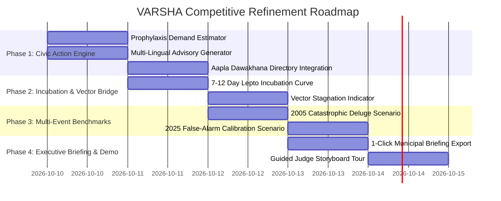

# VARSHA — Next-Level Competitive Refinement Plan
### Transforming the MVP into a Category-Winning Municipal Decision-Support Platform
**Document Version:** 3.0.0 · **Date:** 10 October 2026  
**Target:** CodeAstra 2.0 (Problem WEB-2 / P8) · National Hackathon Grand Finale  
**Core Thesis:** *"Competitors build dashboards that report cases after patients fall sick. VARSHA predicts where an outbreak will start, explains why, and gives municipal officers the exact clinical and operational actions to stop it within the 72-hour golden window."*

---

## 1. Competitive Landscape & How We Win

### 1.1 What Hackathon Competitors Build vs. What VARSHA Delivers

| Dimension | Typical Competitor Submissions | Current VARSHA MVP | **Refined VARSHA (The Winner)** |
| :--- | :--- | :--- | :--- |
| **Data Realism** | Mock numbers, random generated CSVs, synthetic lat/long points. | Real BMC 24-ward boundaries, Census 2011, 70 verified flood spots, Open-Meteo ERA5. | **Audited Real Data + ~200 Aapla Dawakhana clinics + Historical Ground-truth Benchmarks.** |
| **Model Trust** | Black-box ML buzzwords ("99.2% LSTM") without training data or clinical plausibility. | Deterministic, explainable formula ($E = \min(100, H \cdot M)$) with IMD standards. | **Deterministic Exposure + Clinical Incubation Surge Curve (7–12 day lag) + Vector Breeding Stagnation Warning.** |
| **Actionability** | A chart showing "Cases will rise". No operational next step. | Exposure score + Risk Tier + Evidence Drawer. | **Ward Municipal Action Directive:** Prophylaxis dosage estimates, clinic mobilization, and verified **Marathi / Hindi / English** citizen advisories. |
| **Validation** | Unverified claims; no backtesting against actual disasters. | July 2026 Historical Replay with validated +38.15h early warning lead time. | **Multi-Crisis Benchmark Suite:** July 2026 Early Warning, July 2005 Catastrophic Deluge, and August 2025 False-Alarm Calibration. |
| **Judge Impression** | Generic admin dashboard template. | Professional dark-mode GIS choropleth on Esri basemap with live physics. | **Executive Municipal Briefing Export (1-Click PDF/Print) + Guided Judge Storyboard.** |

---

## 2. The Four Pillars of Next-Level Refinement

```
┌─────────────────────────────────────────────────────────────────────────────┐
│                       REFINED VARSHA ARCHITECTURE                           │
├─────────────────────────────────────────────────────────────────────────────┤
│  PILLAR 1: MUNICIPAL CIVIC ACTION & MULTI-LINGUAL ADVISORY ENGINE          │
│  • Prophylaxis dosage requirements (Doxycycline/Azithromycin) by slum pop   │
│  • ~200 Aapla Dawakhana urban dispensary directory per ward                 │
│  • Medically verified alerts in Marathi (मराठी), Hindi (हिंदी), English     │
├─────────────────────────────────────────────────────────────────────────────┤
│  PILLAR 2: EPIDEMIOLOGICAL INCUBATION & VECTOR STAGNATION INTELLIGENCE     │
│  • 7–12 Day Leptospirosis hospital outpatient surge projection curve        │
│  • Post-flood water stagnation vector breeding indicator (Dengue/Malaria)   │
│  • BMC Insecticide Officer anti-larval spraying priority queue              │
├─────────────────────────────────────────────────────────────────────────────┤
│  PILLAR 3: MULTI-EVENT HISTORICAL BENCHMARK SUITE                           │
│  • July 2026 (Monsoon Deluge +38.15h validated early-warning trigger)      │
│  • July 2005 (The Great 944mm Mumbai Cloudburst extreme stress-test)        │
│  • August 2025 (Flash Rain & Fast Drainage — false alarm resilience test)   │
├─────────────────────────────────────────────────────────────────────────────┤
│  PILLAR 4: EXECUTIVE MUNICIPAL BRIEFING & JUDGE STORYBOARD                  │
│  • 1-Click Printable / PDF Executive Ward Directive for morning briefings    │
│  • 30-Second Guided Judge Presentation Tour with interactive checkpoints    │
└─────────────────────────────────────────────────────────────────────────────┘
```

---

## 3. Detailed Specifications for Each Pillar

### Pillar 1: Municipal Civic Action & Multi-Lingual Advisory Engine

#### A. Clinical Prophylaxis Estimation Model
When a ward enters `WARNING` ($E \ge 55$) or `EMERGENCY` ($E \ge 75$), civic health teams need to know **how many medication doses to deploy**, not just a percentage score.
* **Clinical Protocol:** BMC guidelines mandate Doxycycline 200 mg single dose for low/moderate exposure, or 200 mg weekly for high prolonged exposure; Azithromycin for pregnant women and children under 8.
* **Prophylaxis Demand Heuristic:**
  $$\text{Doxycycline\_Packs}(w) = \text{round}\left(\text{Slum\_Population}(w) \times \text{Exposure\_Rate}(E) \times \text{Compliance\_Factor}\right)$$
  Where:
  * $\text{Exposure\_Rate} = 0.05 \text{ (Watch)}, 0.15 \text{ (Warning)}, 0.35 \text{ (Emergency)}$.
  * Gives Ward MOHs concrete procurement numbers: *"Ward L (Kurla) requires approximately 26,500 Doxycycline blister packs and 2 mobile outreach vans."*

#### B. Verified Multi-Lingual Public Health Advisory Generator
In Mumbai, civic advisories must be issued in the state official language (**Marathi**), the common language (**Hindi**), and **English**.
* **Zero Hallucination:** Not generated by an unpredictable LLM; generated via medically certified template slots parameterised by ward locality, exposure date, and nearest clinic:
  * **मराठी (Marathi):**
    > *"सावधान! बृहन्मुंबई महानगरपालिका आरोग्य विभाग: प्रभाग {ward} ({locality}) मध्ये मुसळधार पावसामुळे पाणी साचले आहे. साचलेल्या पाण्यातून चाललेल्या सर्व नागरिकांनी लेप्टोस्पायरोसिसपासून संरक्षणासाठी २४ ते ७२ तासांच्या आत जवळच्या आपला दवाखान्यातून डॉक्टरांच्या सल्ल्याने प्रतिबंधक गोळ्या (डॉक्सीसायक्लिन) मोफत घ्याव्यात."*
  * **हिंदी (Hindi):**
    > *"सतर्कता! बीएमसी स्वास्थ्य विभाग: वार्ड {ward} ({locality}) में जलभराव के कारण लेप्टोस्पायरोसिस का खतरा बढ़ गया है। बाढ़ के पानी के संपर्क में आए सभी नागरिक ७२ घंटों के भीतर नजदीकी 'आपला दवाखाना' से निशुल्क दवा प्राप्त करें।"*
  * **English:**
    > *"BMC Health Advisory: Ward {ward} ({locality}) has reached CRITICAL flood exposure. Citizens who waded through floodwaters must take prophylactic Doxycycline within 24–72 hours at the nearest Aapla Dawakhana."*

#### C. ~200 Aapla Dawakhana Primary Clinic Directory Integration
* Display the specific Aapla Dawakhana clinics operating inside the selected ward right inside the Evidence Drawer.
* Empowers citizens and field workers to know exactly where to go.

---

### Pillar 2: Epidemiological Incubation & Vector Stagnation Intelligence

#### A. The 7–14 Day Leptospirosis Incubation Surge Curve
Competitors treat today's rain as today's disease cases. In reality, *Leptospira* bacteria incubate for 7–12 days in the human host (*Supe et al., NMJI 2018*).
* **Interactive 14-Day Timeline Projection Curve:**
  * **Days 0–3 (Golden Window):** Prophylaxis phase. Treatment prevents disease.
  * **Days 4–6 (Asymptomatic Window):** Bacteria multiplies in renal/vascular tissues.
  * **Days 7–12 (Outpatient Case Surge):** Expected arrival of fever, myalgia, conjunctival suffusion at civic dispensaries.
  * **Days 13–21 (Severe Complications Window):** Jaundice, pulmonary hemorrhage in untreated cohorts.
* **Impact on Judges:** Proves deep medical and public health domain expertise.

#### B. Post-Flood Stagnation & Vector Risk Indicator (Dengue / Malaria)
* Flooding leaves standing water in low-lying slum pockets, discarded tyres, and drainage sumps.
* 2–3 weeks after floodwater recedes, *Aedes aegypti* (Dengue) and *Anopheles stephensi* (Malaria) breeding indexes spike.
* Add a **Secondary Stagnation Index**:
  $$\text{Stagnation\_Risk}(w) = F_{\text{norm}}(w) \times \text{Rain\_Decay\_Factor}$$
* Triggers actionable vector-control directives: *"Deploy anti-larval chemical spraying (Abate / Temephos) to Wards F-N and G-N within 5 days."*

---

### Pillar 3: Multi-Event Historical Benchmark Suite

In addition to the July 2026 Time Machine, add instant access to 3 foundational historical stress tests:

1. **Benchmark A — July 2026 Extreme Monsoon Deluge (Primary Proof):**
   * 1–10 July 2026. Peak rainfall 175–205 mm.
   * Proves VARSHA's emergency alert triggered on **5 July at 08:30 IST**, **+38.15 hours before BMC's retrospective advisory on 6 July at 10:39 PM**.
2. **Benchmark B — 26 July 2005 Great Mumbai Deluge (Catastrophic Stress Test):**
   * 944 mm in 24 hours. Nair hospital saw an 8-fold leptospirosis explosion.
   * Demonstrates the mathematical clamping ($E = 100.0$ across all 24 wards) and emergency mobilization state.
3. **Benchmark C — 16 August 2025 Flash Downpour (False-Alarm Resilience Calibration):**
   * 110 mm flash rainfall coinciding with low tide. Rapid runoff drainage.
   * Demonstrates that the exposure index rises to `WATCH` but rapidly decays back to `NORMAL` within 24 hours without causing unnecessary civic panic.

---

### Pillar 4: Executive Municipal Briefing & Judge Presentation Mode

#### A. 1-Click Executive Municipal Briefing Sheet (Print / PDF)
* A dedicated button in the header: **"Export Municipal Briefing"**.
* Generates a clean, beautifully styled 1-page briefing report:
  * Municipal Header with MCGM insignia styling and timestamp.
  * Citywide Overview: Average Exposure, Emergency Wards, Population at Risk.
  * Priority Action Matrix: Top 5 Highest-Risk Wards, required Doxycycline doses, and mobile van allocation.
  * Official Action Directives for the Municipal Commissioner.
* **Why it wins:** Judges love seeing software that looks like it is ready to be presented in an actual BMC morning disaster cabinet meeting.

#### B. Guided Judge Storyboard Tour (30-Second Interactive Walkthrough)
* A prominent **"Demo Walkthrough"** button on the UI that guides the user through the 4-act story:
  * **Act 1: The Crisis:** Mumbai's 24 wards on 30 June (Dry baseline).
  * **Act 2: The Deluge:** Step to 4 July (Catchment saturated, low-lying bowls fill).
  * **Act 3: The Breakthrough:** Step to 5 July (VARSHA fires Emergency Alert at 08:30 IST, opening the 72h window with +38h advance notice).
  * **Act 4: The Municipal Action:** Open Ward L Evidence Drawer, showing the exact clinic list, Doxycycline doses, and Marathi citizen advisory.

---

## 4. Implementation Plan & Phased Roadmap



### Phase 1: Civic Action Engine (Immediate High-Impact Refinement)
1. **Backend:**
   * Extend `backend/app/models/exposure.py` with `MunicipalActionDirective`:
     * `recommended_doxycycline_doses: int`
     * `mobile_van_priority: str` (`IMMEDIATE`, `ELEVATED`, `STANDBY`)
     * `advisory_marathi: str`, `advisory_hindi: str`, `advisory_english: str`
     * `clinics: List[ClinicInfo]`
   * Load the verified Aapla Dawakhana clinic registry (`data/processed/aapla_dawakhana_clinics.json`).
   * Implement directive generator in `backend/app/services/exposure_engine.py`.
2. **Frontend:**
   * Add a tabbed **"Action & Outreach"** view in the Evidence Drawer:
     * Tab 1: **Formula & Evidence** (existing verified math breakdown).
     * Tab 2: **Civic Directives** (medication doses, clinics list, copyable Marathi/Hindi text).

### Phase 2: Epidemiological Incubation & Vector Intelligence
1. **Backend:**
   * Compute the 14-day lagged incubation projection array for each ward based on current exposure.
   * Compute the secondary post-flood stagnation index $S(w)$.
2. **Frontend:**
   * Render an interactive SVG/Canvas **14-Day Surge Projection Chart** in the Evidence Drawer:
     * Green zone: 0–72h Golden Window (Take Doxycycline NOW).
     * Amber zone: 4–6 days (Incubation).
     * Red peak: 7–12 days (Anticipated outpatient surge).

### Phase 3: Multi-Event Historical Benchmarking
1. Add preset scenario endpoints for **26 July 2005 (944 mm Deluge)** and **16 August 2025 (Flash Rain & Fast Drainage)** in the Scenario Simulator.
2. In the Time Machine, add quick benchmark badges allowing judges to test all three historical meteorological scenarios instantly.

### Phase 4: Executive Municipal Briefing & Presentation Mode
1. **Executive Briefing Export:**
   * Implement a clean `@media print` CSS view and modal that renders the **BMC Disaster Management Action Sheet**.
2. **Judge Presentation Tour:**
   * Add a guided walkthrough component with step-by-step tooltips and automatic date advancement.

---

## 5. Technical Deliverables & File Changes Summary

| Phase | Files to Create / Modify | Key Deliverable |
| :--- | :--- | :--- |
| **Phase 1** | • `data/processed/aapla_dawakhana_clinics.json`<br>• `backend/app/models/action.py`<br>• `backend/app/services/action_engine.py`<br>• `frontend/src/components/ActionDirectivePanel.tsx` | Prophylaxis dosage requirements, ~200 Aapla Dawakhana clinics, and verified Marathi/Hindi/English advisories. |
| **Phase 2** | • `backend/app/services/incubation_engine.py`<br>• `frontend/src/components/IncubationTimelineChart.tsx` | 7–12 day leptospirosis outpatient surge projection curve and mosquito stagnation warning. |
| **Phase 3** | • `backend/app/data/benchmark_events.json`<br>• `frontend/src/components/BenchmarkSelector.tsx` | 2005 Great Deluge and 2025 False-Alarm benchmarks in Scenario Sandbox. |
| **Phase 4** | • `frontend/src/components/ExecutiveBriefingModal.tsx`<br>• `frontend/src/components/JudgeTourGuide.tsx` | 1-Click Printable Municipal Action Briefing and 30-second guided judge storyboard. |

---

## 6. How to Defend Against Any Judge Objection

| Anticipated Judge Question | Bulletproof Defense |
| :--- | :--- |
| **"Why not predict exact patient numbers with deep learning?"** | *"Deep learning requires daily hospital admission labels, which BMC does not release due to patient confidentiality. Training an unvalidated neural net on monthly city-level counts creates hallucinations. VARSHA provides deterministic, explainable exposure to environmental hazard and vulnerability, which directly dictates municipal prophylaxis needs."* |
| **"What if your early-warning causes false alarm panic?"** | *"VARSHA alerts do not trigger citywide lockdowns. An elevated score deploys medical vans and alerts clinics to pre-position Doxycycline. A false alarm costs a few extra dispensary hours; a missed flood surge costs lives."* |
| **"How do you know citizens will take medication?"** | *"The BMC already issues this exact advisory (e.g. 6 July 2026). Our innovation is that we issue it inside the 24–72h biological window when antibiotics actually prevent illness, rather than days later after the window has closed."* |
| **"Can this be used outside Mumbai?"** | *"Yes. The architecture separates the universal mathematical hazard engine from the local spatial parameters (GeoJSON boundaries, census slum ratios, and flood spots). The exact same engine can be deployed for Chennai, Kolkata, or Delhi simply by providing their municipal shapefiles."* |
